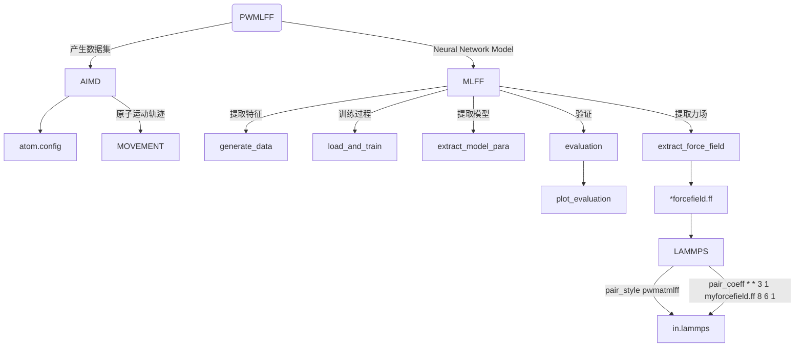

# Molecure Ethylene carbonate system

下文将以 C3H4O3 孤立体系为例，介绍如何使用 **PWMLFF Neural Network Model** 进行训练，以及如何使用训练好的模型进行预测。

整个程序运行逻辑大致分为：



## 1. 产生数据集

以 PWmat AIMD 模拟得到的 C3H4O3 数据为例，数据文件为`MOVEMENT`，包含 200 个结构，每个结构包含 10 个原子。

**etot.input**输入文件示例：

```bash
8  1   
JOB = MD
MD_DETAIL = 2 200 1 400 400
XCFUNCTIONAL = PBE
Ecut = 60
ECUT2 = 240
MP_N123 = 1 1 1 0 0 0 3
ENERGY_DECOMP = T
OUT.STRESS = F
IN.ATOM = atom.config
IN.PSP1 = C.SG15.PBE.UPF
IN.PSP2 = H.SG15.PBE.UPF
IN.PSP3 = O.SG15.PBE.UPF
```

- 可选项`ENERGY_DECOMP`：是否将总 DFT 能量分解为属于每个原子的能量（原子能量）。结果输出在`MOVEMENT`文件中。如需使用或训练原子能量，需要将其设置为`T`。
- 可选项`OUT.STRESS`：是否输出应力信息，如需训练`Virial`，则需要将其设置为`T`。
- 其他参数含义参考[PWmat manual](http://www.pwmat.com/pwmat-resource/Manual.pdf)。

## 2. 训练过程

### 2.1 提取特征

新建目录，放置`MOVEMENT*`文件。或者`MOVEMENT*`文件也可以放置在其他目录下，只需要通过修改输入文件`*.json`中的`train_movement_path`路径进行训练。

### 2.2 训练输入文件

当前目录下，新建`*.json`文件(如`nn_ec.json`)，该文件包含一系列需要传入的参数。

**输入文件示例  ([输入文件其他参数说明](#5-输入文件其他参数说明))：**

```json
{   
    "train_movement_file":["./EC_MOVEMENT"],

    "model_type": "NN",
    "atom_type":[8,6,1]
}

```

- `train_movement_file`: `MOVEMENT`文件存放名。可以设置同时多个文件。请根据实际情况进行修改。
- `model_type`：模型类型，现在训练所使用的模型。其他模型类型的训练及参数配置参考[参数细节](/en/next/PWMLFF/Parameter%20details)。
- `atom_type`：原子类型，8, 6 和 1 分别为 O, C 和 H 的原子序数.

### 2.3 运行

以下 slurm 示例脚本适用于 Mcloud,提交任务时确保已经加载必要的环境和模块。

```bash
#!/bin/sh
#SBATCH --partition=3080ti
#SBATCH --job-name=mlff
#SBATCH --nodes=1
#SBATCH --ntasks-per-node=1
#SBATCH --gres=gpu:1
#SBATCH --gpus-per-task=1

PWMLFF train nn_ec.json > log
```

交互式运行：

```bash
$ srun -p 3080ti --gres=gpu:1 --pty /bin/bash
$ PWMLFF train nn_ec.json
```

:::tip
产生feature与train可以单独运行：

- `PWMLFF gen_feat nn_ec.json` - 仅用于产生特征。
- `PWMLFF train nn_ec.json` - 用于加载特征,对特征进行处理后开始训练。直接运行`train`会自动调用`gen_feat`。如果`gen_feat`已经运行过，可以在`.json`文件中设置`train_feature_path`来指定feature所在路径，同时注释掉`train_movement_file`

:::

---

程序运行后，会在程序执行目录下生成`forcefield`和`model_record`目录:

```
EC_system/
└── dir
    ├── forcefield
    │   ├── forcefield.ff
    │   ├── fread_dfeat            
    │   │   ├── data_scaler.txt           
    │   │   ├── feat.info            
    │   │   ├── vdw_fitB.ntype            
    │   │   └── Wij.txt     
    │   ├── input          
    │   │   ├── (egroup.in)  # 仅对MOVEMENT中存在ATOMIC ENERGY时起作用           
    │   │   └── *feature.in     
    │   └── (output)                     
    │       └── grid*   # feature 1, 2时使用
    │
    └── model_record
    │   ├── epoch_train.dat     # 每个 epoch 的训练误差
    │   ├── epoch_valid.dat     # 每个 epoch 的验证误差
    │   ├── iter_train.dat      # 每个 batch 的训练误差     
    │   ├── iter_valid.dat      # 每个 batch 的验证误差     
    │   ├── nn_model.ckpt       # 模型文件   
    │   └── scaler.pkl          # extracting scaler values of the model

```

:::info epoch_loss.dat&epoch_loss_valid.dat


- `loss` 对应训练总误差
- `RMSE_Etot` 对应训练能量误差
- `RMSE_F` 对应训练力误差

<font color='red'>如果训练集的误差比验证集的误差明显偏小,表明训练过拟合,可适当增加训练集的大小或调整 batch_size 的数量。</font>

:::

## 3. 验证/测试

训练完成后，可以对模型进行验证/测试，以确定模型的拟合效果。

新建目录(如`MD`)，将另一个的`MOVEMENT`文件复制到该目录中。同时在`.json`文件中设置`test_movement_file`,`test_dir_name`参数以及添加`model_load_file`参数。

**相关输入示例：**
```json
    "test_movement_file":["./MD/MOVEMENT"],
    "test_dir_name":"test_dir",
    "model_load_file":"./model_record/nn_model.ckpt",
```

**验证程序运行示例：**

将PWMLFF train nn_ec.json中的`train`修改为`test`：

```python
PWMLFF test nn_ec.json
```

程序运行完成后，验证结果保存在`test_dir_name`设置的`test_dir/`目录下
<center></center>

## 4. Lammps 模拟

将训练完成后生成的`*.ff`力场文件用于 lammps 模拟。（需使用经过修改的[版本](https://github.com/LonxunQuantum/Lammps_for_PWMLFF)重新编译）

为了使用 PWMLFF 生成的力场文件，需要在 lammps 的输入文件中设置以下内容：

```bash
pair_style      pwmatmlff
pair_coeff      * * 3 1 forcefield.ff 8 6 1
```

其中`3`表示使用 Neural Network 模型产生的力场，`1`表示读取 1 个力场文件，`forcefield.ff`为 PWMLFF 生成的力场文件名称，`8`, `6`, `1` 分别为 O, C, H 的原子序数。

以下是lammps输入文件示例(nvt系综)：

```bash
units           metal
boundary        p p p
atom_style      atomic
processors      * * *
neighbor        2.0 bin
neigh_modify    every 10 delay 0 check no

read_data       POSCAR.lmp

pair_style      pwmatmlff
pair_coeff      * * 3 1 forcefield.ff 8 6 1
velocity        all create 300 206952 dist gaussian
timestep        0.001
fix             1 all nvt temp 300 300 0.1
thermo_style    custom step pe ke etotal temp vol press
thermo          1
dump            1 all custom 1 traj.xyz id type x y z  vx vy vz fx fy fz
run             1000 
```

## 5. 输入文件其他参数说明

```json
{   
    "recover_train":false,
    "work_dir":"./work_train_dir",
    "reserve_work_dir": false,
   
    "train_movement_file":["./PWdata/MOVEMENT"],

    "forcefield_name": "forcefield.ff",
    "forcefield_dir": "forcefield",

    "test_movement_file":["./MD/MOVEMENT"],
    "test_dir_name":"test_dir",

    "train_valid_ratio":0.8,

    "model_type": "NN",
    "atom_type":[8,6,1],
    "feature_type":[7],
    "max_neigh_num":100, 
    "model":{
        "fitting_net": {
            "network_size": [15, 15, 1]
        },
        "descriptor": {
            "Rmax":6.0, 
            "Rmin":0.5,            
            
            "1":{
                "numOf2bfeat": 24,
                "iflag_grid": 3,
                "fact_base": 0.2,
                "dR1": 0.5,
                "iflag_ftype": 3
            },
            "2":{
                "numOf3bfeat1" : 3,
                "numOf3bfeat2" : 3,
                "iflag_grid" : 3,
                "fact_base" : 0.2,
                "dR1" : 0.5,
                "dR2" : 0.5,
                "iflag_ftype" : 3
            },
            "3":{
                "n2b": 6,
                "w": [1.0, 1.5, 2.0]
            },
            "4":{
                "n3b": 20,
                "zeta": 2.0,
                "w": [0.5, 1.0, 1.5, 2.0, 2.5, 3.0, 3.5, 4.0, 4.5, 5.0]
            },
            "5":{
                "n_MTP_line":5
            },
            "6":{
                "J":3.0,
                "n_w_line":2,
                "w1":[0.9, 0.1, 0.8, 0.2, 0.7, 0.3, 0.6, 0.4],
                "w2":[0.1, 0.9, 0.2, 0.8, 0.3, 0.7, 0.3, 0.6]
            },
            "7":{
                "M":25,
                "M2":4,
                "weight_r":1.0
            },
            "8": {
                "M":8,
                "weight_r":1.0,
                "w":[1.0, 1.5, 2.0, 2.5]
            }
        }
    },

    "optimizer":{
        "optimizer":"LKF",
        "block_size":5120, 
        "kalman_lambda":0.98, 
        "kalman_nue":0.99870,
        "nselect":24,
        "groupsize":6,
        
        "batch_size": 1,
        "epochs":5,
        "start_epoch":1,

        "print_freq":10,

        "train_energy":true,
        "train_force":true,
        "train_ei":false,
        "train_virial":false,
        "train_egroup":false,
    
        "pre_fac_force":2.0,
        "pre_fac_etot":1.0, 
        "pre_fac_ei":1.0,
        "pre_fac_virial":1.0, 
        "pre_fac_egroup":0.1
        
        }
}

```

- `recover_train`: 是否从上次训练中断/完成处继续训练。如果为`true`，读取默认`model_load_path`和`model_name`，程序则会从上次训练中断/完成处继续训练。见[参数细节](/en/next/PWMLFF/Parameter%20details)。
- `work_dir`: 训练过程中的中间文件保存目录。训练完成后自动删除。`reserve_work_dir`为`true`时，训练完成后不删除该目录。
- `train_movement_file`: `MOVEMENT`文件存放名。可以设置同时多个文件。请根据实际情况进行修改。
- `forcefield_name`: 生成的力场文件名称。可不设置。
- `forcefield_dir`: 生成的力场文件存放的目录。可不设置。
- `test_movement_file`: 用于训练完成后验证模型的`MOVEMENT`文件。([详情见验证测试部分](#3-验证测试))
- `test_dir_name`: 训练完成后验证模型的`MOVEMENT`文件的存放目录。
- `model_type`：模型类型，现在训练所使用的模型。其他模型类型的训练及参数配置参考[参数细节](/en/next/PWMLFF/Parameter%20details)。
- `atom_type`：原子类型，8, 6 和 1 分别为 O, C 和 H 的原子序数.
- `max_neigh_num`：最大近邻原子数。
- `model`: 模型参数，具体参数配置参考[参数细节](/en/next/PWMLFF/Parameter%20details)。
- `Rmax`：特征的最大截断半径。
- `Rmin`：特征的最小截断半径。
- `feature_type`：特征类型，7 对应 DP-Chebyshev feature，详见[特征类型](/en/next/PWMLFF/Appendix-1)。
- `optimizer`：优化器参数，推荐使用`LKF`。通常情况下，对于大体系大网络，使用`LKF`优化器可以加速训练。其他优化器及更多的参数配置参考[参数细节](/en/next/PWMLFF/Parameter%20details)。
- `epochs`：训练迭代次数。根据`MOVEMENT`总的 images 数量修改,images 少时可适当增加,如 30。