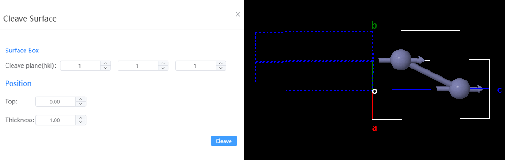
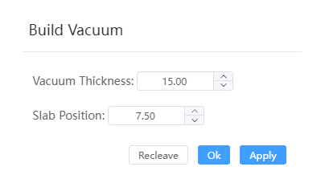

# Cleave Surface

- Surface Box: Enter HKL information for the cleave plane
- Position:
  - Top: The distance of the cleave plane from the origin O, in angstroms
  - Thickness: The thickness of the slab, in angstroms
- Cleave: Switch to the build vacuum interface after clicking
  

  - Vacuum Thickness: Add a vacuum layer to the slab
  - Slab position: The position of the centroid of the slab in the vacuum direction
  - Recleave: Click to return to the cleave surface interface
  - Apply: Add the vacuum to preview
  - OK: Add the vacuum and then close the window
