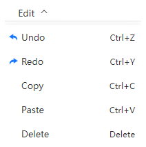

# Edit menu

- `Undo`: Return to the state before the previous action, shortcut Ctrl+z
- `Redo`: Go back to the state after the next action occurred, shortcut Ctrl+y
- `Copy`: After selecting an atom, you can copy it, shortcut key Ctrl+c
- `Paste`: Paste the copied atom to the current window, shortcut key Ctrl+v; The pasted atoms will be placed in random positions
- `Delete`: Delete the currently selected atom, shortcut key Delete