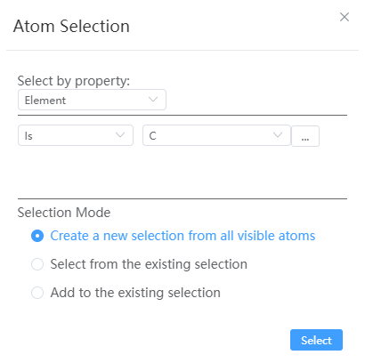

# Atom Selection

- Select by property:
  - Element: all atoms that meet the requirements are screened out according to whether they are or are not certain elements; Depending on whether one or none of them is selected, all atoms that meet the requirements are screened out, and a variety of elements can be selected
  - Magnetic moment: Filter out all atoms that meet the requirements according to the magnitude of the magnetic moment
  - Fractional coordinates: Filter out all atoms that meet the requirements according to the fractional coordinates
  - Cartesian coordinates: Filter out all atoms that meet the requirements according to Cartesian coordinates
  - Radial distance: All atoms that meet the requirements are screened according to the selected atom center of mass or the radial distance of a certain location
  - Chain: Only protein structures are supported
- Selection Mode:
  - Create a new selection from all visible atoms: Default option
  - Select from the existing selection
  - Add to the existing selection