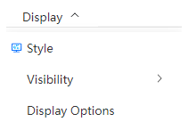

# Display menu

<!--  -->
<!--  -->

- [Display Style](/en/next/Q-Studio/界面及功能/菜单/qstudio_manual_view_display)
- `Visibility`: Hides or shows selected atoms; When atoms are not selected, you can only click Show, and all atoms will be displayed
- `Display Options`: turn anti-aliasing, perspective depth on or off; Modify the background color
  
  

