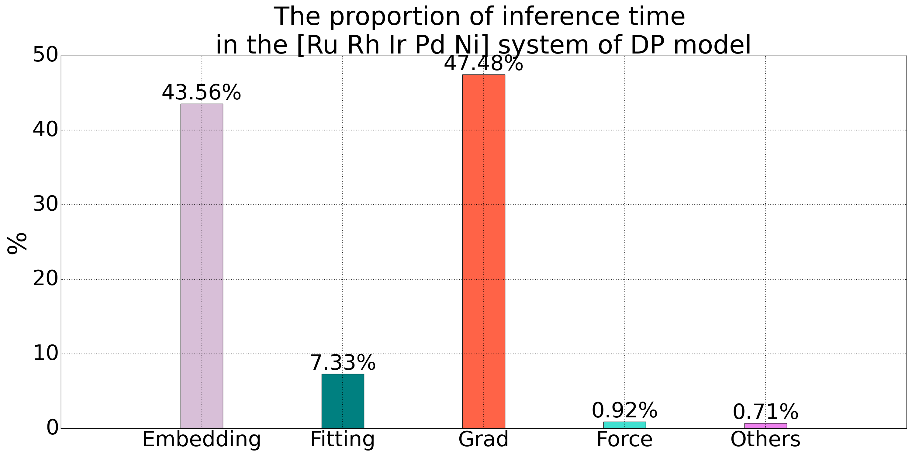

# DP

## **[操作演示](./dp-tutorial.md)**

## 模型介绍
<div style={{ display: 'inline-block', marginRight: '10px' }}>
  
</div>

DP 模型请参考文献：

- [SC’20] Weile Jia, Han Wang, Mohan Chen, Denghui Lu, Lin Lin, Roberto Car, E Weinan, Linfeng Zhang*, "Pushing the Limit of Molecular Dynamics with Ab Initio Accuracy to 100 Million Atoms with Machine Learning," SC20: International Conference for High Performance Computing, Networking, Storage and Analysis, 2020, pp. 1-14, doi: 10.1109/SC41405.2020.00009.(CCF-A)(Gordon Bell Prize)

- Han Wang, Linfeng Zhang, Jiequn Han, and Weinan E. "DeePMD-kit: A deep learning package for many-body potential energy representation and molecular dynamics." Computer Physics Communications 228 (2018): 178-184. doi:10.1016/j.cpc.2018.03.016

- Zhang L, Han J, Wang H, et al. End-to-end symmetry preserving inter-atomic potential energy model for finite and extended systems[J]. Advances in neural information processing systems, 2018, 31.

- Lu D, Jiang W, Chen Y, et al. DP compress: A model compression scheme for generating efficient deep potential models[J]. Journal of chemical theory and computation, 2022, 18(9): 5559-5567.

### type embedding


由于 DP 模型的 Embedding Net 数目是元素类型数目$N$的$N^2$倍。一方面，当体系中元素类型较多时制约了模型的训练速度，以及推理速度。另一方面，这也制约了 DP 模型在通用大模型方面的潜力。考虑到$N^2$个 Embedding net 其实隐含了对元素类型的编码，因此我们通过调整$S_{ij}$，将元素类型的物理属性信息与$S_{ij}$做拼接，则只需要一个 Embedding net 即可达到与$N^2$相似效果。

对于$S_{ij}$，$i$为中心原子，这里将$j$对应的元素类型的[物理属性](../../Parameter%20details#type_physical_property)与$S_{ij}$做拼接，组成一个长度为 1+物理属性数量的 Vector 送入 Embedding Net。在我们[五元合金(钌、铑、铱、钯、镍)数据集](https://github.com/LonxunQuantum/MatPL_library/tree/main/alloy/Ru_Rh_Ir_Pd_Ni)以及[LiGePS 四元数据集(1200K)](https://github.com/LonxunQuantum/MatPL_library/tree/main/LiGePS)的测试中，基于这种 Type embedding 方法的 DP 模型，能够在达到或者超过标准的 DP 模型预测精度的同时，对训练时间减少 27%，详细结果见[性能测试](#type_performance)。

## 使用方法

用户只需要在控制训练的 json 文件中加入$type\_embedding$参数，即可开启模型训练，将使用默认物理属性训练，参见项目案例 **example/LiGePS/ligeps.json**。

```json
{
  "type_embedding": true
}
```

用户也可以在该 Json 文件的 [model 参数](../../Parameter%20details#type_physical_property) 中指定所需要的物理属性。

## 性能测试{#type_performance}

### 精度

[五元合金混合数据集(9486 个构型)](https://github.com/LonxunQuantum/MatPL_library/tree/main/alloy/Ru_Rh_Ir_Pd_Ni)下，Type embedding 方法相对于标准的 DP 模型在验证集上的预测精度对比:

<table>
  <tr>
    <td>
      
      <p>图1: 五元合金体系验证集上的能量误差下降</p>
    </td>
    <td>
      
      <p>图2: 五元合金体系验证集上的力误差下降</p>
    </td>
  </tr>
</table>

[四元 LiGePS 构型的数据集（10000 个构型 1200K）](https://github.com/LonxunQuantum/MatPL_library/tree/main/LiGePS)下 Type embedding 方法相对于标准的 DP 模型在验证集上的预测精度对比:

<table>
  <tr>
    <td>
      
      <p>图1: 四元LiGePS体系验证集上的能量误差下降</p>
    </td>
    <td>
      
      <p>图2: 四元LiGePS体系验证集上的力误差下降</p>
    </td>
  </tr>
</table>

### 训练时间

<table>
  <tr>
    <td>
      
      <p>图1: 五元合金体系训练总时间</p>
    </td>
    <td>
      
      <p>图2: 四元LiGePS体系训练总时间</p>
    </td>
  </tr>
</table>
在 Lammps 中的力场调用方式与前述标准的 DP 模型调用方法相同。

### 多项式模型压缩

DP 模型的 Embedding net 网络数目是原子类型数目$N$的$N^2$倍，随着原子类型增多，Embedding net 数目会快速增加，导致用于反向传播求导的计算图的规模会增加，成为 DP 模型做推理的瓶颈之一。如下我们对于一个五元合金系统在 DP 模型的推理过程的时间统计所示，对于 Embedding net 计算以及梯度计算的时间占比超过 90%，这存在大量的优化空间。Embedding net 的输入为一个$S_{ij}$的单值，输出为$m$个值（$m$为 Embedding net 最后一层神经元数目）。因此，可以将 Embedding net 通过$m$个单值函数代替。

这里实现论文[Lu D, Jiang W, Chen Y, et al. DP compress: A model compression scheme for generating efficient deep potential models](https://pubs.acs.org/doi/10.1021/acs.jctc.2c00102?fig=fig3&ref=pdf)中使用的[五阶多项式](#5order_cmp)压缩方法，同时我们也提供了基于 Hermite 插值方法的[三阶多项式](#3order_cmp)压缩方法供用户自由选择。



## 使用方法

对于一个训练后 DP 模型做模型压缩，完整的模型压缩指令如下：

```json
MatPL compress dp_model.ckpt -d 0.01 -o 3 -s cmp_dp_model
```
* compress 是压缩命令
* dp_model.ckpt为待压缩模型文件名称，为必须要提供的参数
* -d 为S_ij 的网格划分大小，默认值为0.01
* -o 为模型压缩阶数，3为三阶模型压缩，5为五阶模型压缩，默认值为3
* -s 为压缩后的模型名称，默认名称为“cmp_dp_model”

模型压缩之后，在 lammps 中做分子动力学模拟使用方式与标准的[DP 模型](./dp-tutorial.md/#lammps-md)相同。

## 性能测试{#cmp_time}

<!--
 type embedding的模型压缩还没有加入到lammps中，所以先不写
 -->

### 模型压缩精度

我们在 Bulk 铜和五元合金体系上对 DP 模型做了模型压缩，并在测试集上分别做了测试。结果如下图中所示，对于铜体系，我们加入了对二阶插值方法的精度对比，相比于三阶和五阶方法，二阶方法的精度达不到要求。

<table>
  <tr>
    <td>
      
      <p>图1: Bulk铜体系DP模型二阶、三阶与五阶多项式压缩对比</p>
    </td>
    <td>
      
      <p>图2: 五元合金体系DP模型三阶与五阶多项式压缩对比</p>
    </td>
  </tr>
</table>

<!-- #### 不同的 dx 计算时间开销统计？ -->

### 推理速度

<!-- #### embedding net 和 grad 速度提升？ -->

我们统计了五元合金体系下 DP 模型三阶多项式压缩以及未压缩时，在整个测试集上的推理时间。经过多项式压缩后明显减少了反向求导（autograd）时间，这是因为多项式方法能够显著减少 Embedding net 在 pytorch 自动求导时的计算图大小。

<table>
  <tr>
    <td>
      
      <p>图1: 五元合金体系三阶多项式压缩（dx=0.01）与未压缩对比</p>
    </td>
  </tr>
</table>

<!-- #### 在 Lammps 中的速度提升 -->

## 三阶多项式模型压缩过程{#3order_cmp}

### 网格划分

我们扫描全部训练集，得到$s_{ij}$的最大值，由于$s_{ij}$是原子$i$和$j$的三维坐标距离$r_{ij}$函数，当$r_{ij}$ = $r_{cut}$时取最小值。根据$s_{ij}$取值范围按照$dx$值等分为$L$份，则共有$l+1$个插值点，分别记为$x_1,x_2,\cdots,x_l+1$。在实际的使用中，由于训练集的不完备，可能存在一些$s_{ij}$值超出训练集之外，这里我们在上述网格之外，继续增加了$s_{ij}$到$ 10\times s_{ij}$的网格，网格大小设置为$ 10 \times dx$。

### 三阶多项式

对于每个$[x_l,x_{l+1})$区间，采用如下的三阶多项式替代 Embedding net:

$$
g^l_m(x)=a^l_mx^3 + b^l_mx^2 + c^l_mx + d^l_m
$$

这里$m$为 Embedding net 最后一层神经元数量，即 Embedding net 输出值数目，多项式的自变量$x$值应为$s_{ij}-x_l$。在每个网格点上，都需要满足如下两个限定条件。
在每个网格点上限制如下条件。
多项式值与 Embedding net 输出值一致：

$$
y_l = G_m(x_l)
$$

多项式一阶导数与 Embedding net 对$S_{ij}$的一阶导一致：

$$
y'_l = G'_m(x_l)
$$

解得对应系数为

$$
    a^l_m=\frac{1}{\Delta t^3}[(y'_{l+1} + y'_l)\Delta t - 2h]
$$

$$
    b^l_m=\frac{1}{\Delta t^2}[-(y'_{l+1} + 2y'_l)\Delta t + 3h]
$$

$$
    c^l_m=y'_l
$$

$$
    d^l_m=y_l
$$

### 五阶多项式{#5order_cmp}

我们也实现了[DP Compress](https://pubs.acs.org/doi/10.1021/acs.jctc.2c00102?fig=fig3&ref=pdf)中的五阶多项式压缩方法。

对于五阶多项式，对$S_{ij}$的划分方法与五阶方法相同，采用如下的多项式代替 Embedding net：
$$g^l_m(x)=a^l_mx^5+b^l_mx^4+c^l_mx^3+d^l_mx^2+e^l_mx+f^l_m$$

注意：此时多项式的自变量$x$值应为$s_{ij}-x_l$。在每个网格点上，都需要满足如下三个限定条件。

多项式值与 Embedding net 输出值一致：
$$y_l=\mathcal{G}_m(x_l)$$

多项式一阶导数与 Embedding net 对$S_{ij}$的一阶导一致：
$$y'_l=\mathcal{G}'_m(x_l)$$

多项式二阶导数与 Embedding net 对$S_{ij}$的二阶导一致：
$$y''_l=\mathcal{G}''_m(x_l)$$

由此可得六个系数值分别为：

$$a^l_m=\frac{1}{2\Delta t^5}[12h-6(y'_{l+1}+y'_l)\Delta t+(y''_{l+1}-y''_l)\Delta t^2]$$

$$b^l_m=\frac{1}{2\Delta t^4}[-30h+(14y'_{l+1}+16y'_l)\Delta t+(-2y''_{l+1}+3y''_l)\Delta t^2]$$

$$c^l_m=\frac{1}{2\Delta t^3}[20h-(8y'_{l+1}+12y'_l)\Delta t+(y''_{l+1}-3y''_l)\Delta t^2]$$

$$d^l_m=\frac{1}{2}y''_l$$

$$e^l_m=y'_l$$

$$f^l_m=y_l$$

其中 $h=y_{l+1}-y_l$，$\Delta t=x_{l+1}-x_l$


### model compression verification

model compress 方案，将$s_{ij}$取值范围分成$L$等份，则共有$l+1$个插值点，分别记为$x_1,x_2,\cdots,x_{l+1}$。对于每个$[x_l,x_{l+1})$区间，采用如下的五阶多项式替代 embedding network:
$$g^l_m(x)=a^l_mx^5+b^l_mx^4+c^l_mx^3+d^l_mx^2+e^l_mx+f^l_m$$
注意：此时多项式的自变量$x$值应为$s_{ij}-x_l$。在每个网格点上，都需要满足如下三个边界条件：

函数值一致

$$y_l=\mathcal{G}_m(x_l)$$

函数一阶导数一致

$$y'_l=\mathcal{G}'_m(x_l)$$

函数二阶导数一致

$$y''_l=\mathcal{G}''_m(x_l)$$

由此可得六个系数值分别为

$$a^l_m=\frac{1}{2\Delta t^5}[12h-6(y'_{l+1}+y'_l)\Delta t+(y''_{l+1}-y''_l)\Delta t^2]$$

$$b^l_m=\frac{1}{2\Delta t^4}[-30h+(14y'_{l+1}+16y'_l)\Delta t+(-2y''_{l+1}+3y''_l)\Delta t^2]$$

$$c^l_m=\frac{1}{2\Delta t^3}[20h-(8y'_{l+1}+12y'_l)\Delta t+(y''_{l+1}-3y''_l)\Delta t^2]$$

$$d^l_m=\frac{1}{2}y''_l$$

$$e^l_m=y'_l$$

$$f^l_m=y_l$$

其中 $h=y_{l+1}-y_l$，$\Delta t=x_{l+1}-x_l$
<!-- 
## 验证

需满足的条件是当$s_{ij}=x_l,\,x_{l+1}$时，函数值、一阶导数、二阶导数值均与 embedding network 的值相等，此时对应的$x$值分别为$0,\,\Delta t$。五阶多项式函数值为

$$
\begin{aligned}
    g^l_m(x) &= \frac{x^5}{2\Delta t^5}[12h-6(y'_{l+1}+y'_l)\Delta t+(y''_{l+1}-y''_l)\Delta t^2]\\
    &+\frac{x^4}{2\Delta t^4}[-30h+(14y'_{l+1}+16y'_l)\Delta t+(-2y''_{l+1}+3y''_l)\Delta t^2]\\
    &+\frac{x^3}{2\Delta t^3}[20h-(8y'_{l+1}+12y'_l)\Delta t+(y''_{l+1}-3y''_l)\Delta t^2]\\
    &+\frac{1}{2}y''_lx^2+y'_lx+y_l
\end{aligned}
$$

一阶导数为

$$
\begin{aligned}
g^l_m(x)  &=\frac{x^4}{2\Delta t^5}5[12h-6(y'_{l+1}+y'_l)\Delta t+(y''_{l+1}-y''_l)\Delta t^2]\\
&+\frac{x^3}{2\Delta t^4}4[-30h+(14y'_{l+1}+16y'_l)\Delta t+(-2y''_{l+1}+3y''_l)\Delta t^2]\\
&+\frac{x^2}{2\Delta t^3}3[20h-(8y'_{l+1}+12y'_l)\Delta t+(y''_{l+1}-3y''_l)\Delta t^2]\\
&+y''_lx+y'_l
\end{aligned}
$$

二阶导数为

$$
\begin{aligned}
g^l_m(x)&=\frac{x^3}{2\Delta t^5}20[12h-6(y'_{l+1}+y'_l)\Delta t+(y''_{l+1}-y''_l)\Delta t^2]\\
&+\frac{x^2}{2\Delta t^4}12[-30h+(14y'_{l+1}+16y'_l)\Delta t+(-2y''_{l+1}+3y''_l)\Delta t^2]\\
&+\frac{x}{2\Delta t^3}6[20h-(8y'_{l+1}+12y'_l)\Delta t+(y''_{l+1}-3y''_l)\Delta t^2]\\+y''_l
\end{aligned}
$$

当 $x=0$ 时，显然满足需求；下面验证当 $x=\Delta t$ 时的结果，函数值为

$$
\begin{aligned}
g^l_m(\Delta t&)=\frac{1}{2}[12h-6(y'_{l+1}+y'_l)\Delta t+(y''_{l+1}-y''_l)\Delta t^2]\\
&+\frac{1}{2}[-30h+(14y'_{l+1}+16y'_l)\Delta t+(-2y''_{l+1}+3y''_l)\Delta t^2]\\
&+\frac{1}{2}[20h-(8y'_{l+1}+12y'_l)\Delta t+(y''_{l+1}-3y''_l)\Delta t^2]\\
&+\frac{1}{2}y''_l\Delta t^2+y'_l\Delta t+y_l\\
&=h-y'_l\Delta t-\frac{1}{2}y''_l\Delta t^2+\frac{1}{2}y''_l\Delta t^2+y'_l\Delta t+y_l\\
&=y_{l+1}
\end{aligned}
$$

一阶导数值为

$$
\begin{aligned}
g^l_m(\Delta t)&=\frac{5}{2\Delta t}[12h-6(y'_{l+1}+y'_l)\Delta t+(y''_{l+1}-y''_l)\Delta t^2]\\
&+\frac{4}{2\Delta t}[-30h+(14y'_{l+1}+16y'_l)\Delta t+(-2y''_{l+1}+3y''_l)\Delta t^2]\\
&+\frac{3}{2\Delta t}[20h-(8y'_{l+1}+12y'_l)\Delta t+(y''_{l+1}-3y''_l)\Delta t^2]\\
&+y''_l\Delta t+y'_l\\
&=y'_{l+1}-y'_l-y''_l\Delta t+y''_l\Delta t+y'_l\\
&=y'_{l+1}
\end{aligned}
$$

二阶导数值为

$$
\begin{aligned}
g^l_m(\Delta t)&=\frac{20}{2\Delta t^2}[12h-6(y'_{l+1}+y'_l)\Delta t+(y''_{l+1}-y''_l)\Delta t^2]\\
&+\frac{12}{2\Delta t^2}[-30h+(14y'_{l+1}+16y'_l)\Delta t+(-2y''_{l+1}+3y''_l)\Delta t^2]\\
&+\frac{6}{2\Delta t^2}[20h-(8y'_{l+1}+12y'_l)\Delta t+(y''_{l+1}-3y''_l)\Delta t^2]\\
&+y''_l\\
&=y''_{l+1}-y''_l+y''_l\\
&=y''_{l+1}
\end{aligned}
$$ -->
