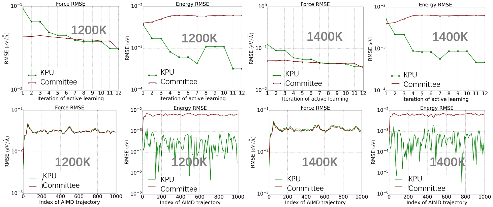

# 3. Active Learning

[PWact](../pwact/README.md) (Active learning based on MatPL) 是我们开发的一款开源的基于 MatPL 的一套自动化主动学习平台，用于高效的数据采样。在PWact中实现了常用的基于多模型委员会查询（Committee Query）的主动学习策略，以及我们基于卡尔曼滤波算法提出的不确定性度量算法（Kalman Prediction Uncertainty， KPU）。基于 KPU 的主动学习还在内测阶段，暂未开放给用户访问。在本例中，我们做了两种主动学习采样的对比。

## 铜结构的两种主动学习

使用如下结构做主动学习采样

  

    
    
铜

  

  

    
    
硅

  

  

    
    
镍

  

### 主动学习轮次数据采集细节

### 主动学习每个轮次对应的 loss 下降情况

这里使用1200K、1400K 的1000步/2fs的AIMD (PWmat) 轨迹作为验证集，分析了主动学习过程中模型随着加入新数据后的误差下降趋势。KPU 和Committee 的力误差在逐渐降低，相对的 Committee 能量误差没有下降，这可能是由于 Committee 的最大力偏差的选点方式对力更有偏好，造成了一些能量预测不够准确的点漏采。在上述验证集下，KPU 与 Committee 最终得到的模型误差，如第二行的四幅图所示，KPU 与 Committee 能量误差相似，而 KPU 的能量误差要比 Committee 更低。

### KPU 在硅、镍的测试

我们也分别对硅和镍在 KPU 上做了主动学习测试，结果如图所示。随着主动学习轮次的进行，模型逐渐覆盖到了测试集所在相空间。

### 铜、硅、镍的声子谱
我们对 KPU 最终得到的模型画了对应的声子谱，图像如图所示。

