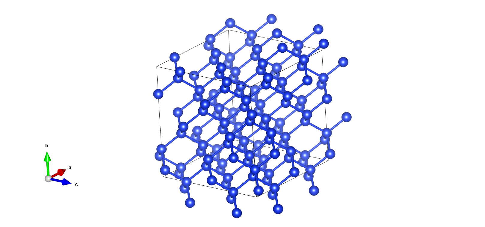

# Example for Si active learning

本案例为硅体系的主动学习过程，案例位于 [`pwact/example/si_pwmat/`](https://github.com/LonxunQuantum/PWact/tree/main/pwact/example/si_pwmat) 首先通过 `INIT_BULK` 构造初始训练集，之后使用初始训练集训练模型，并使用在 INIT_BULK 中使用微扰产生的结构做为初始构型在 `300K` 、`500K` 和 `900K` 做主动学习采样。

以下案例使用的 DFT 计算软件为 PWMAT，我们也提供了 VASP 版本输入文件（请参考[`pwact/example/si_vasp`](https://github.com/LonxunQuantum/PWact/tree/main/pwact/example/si_vasp)）、CP2K版本输入文件（请参考[`pwact/example/si_cp2k`](https://github.com/LonxunQuantum/PWact/tree/main/pwact/example/si_cp2k)）。

请注意，案例中提供的DFT设置仅用于程序执行流程测试，不保证计算精度。



# INIT_BULK

## 启动命令

进入 `pwact/example/si_pwmat/init_bulk` 目录 
```JSON
pwact init_bulk init_param.json resource.json
```

## INIT_BULK 目录结构

INIT_BULK 的[目录结构](#目录1)如下所示，`atom.config`、`POSCAR`、`resource.json`、`init_param.json`、`relax_etot.input`、`relax_etot1.input`、`aimd_etot1.input`、`aimd_etot2.input`为输入文件，`collection` 为执行后的结果汇总目录。

### collection 目录

`datapath.txt`文件内容是预训练数据所在目录记录。

init_config_0 目录为 atom.config 进过驰豫、阔胞、缩放、微扰、aimd 后的结果汇总。

`relax.config` 是对`atom.config` 做驰豫后得到的结构文件；`super_cell.config`是对`relax.config`做 阔胞后得到结构文件；`0.9_scale.config`和`0.95_scale.config`是对`super_cell.config`做晶格缩放后得到的结构文件；

`0.9_scale_pertub`目录包括对`0.9_scale.config`结构做晶格和原子位置微扰后得到的 30 个结构；

`train.xyz` 目录是对微扰后的结构做按照`aimd_etot1.input`做 AIMD 之后，将得到轨迹提取成 extxyz 格式后的结果目录。如果是提取为 `pwmlff/npy` 格式，则为 `PWdata`目录。内容如下所示。`atom_type.npy`是结构的原子类型，`position.npy`是结构中原子的位置信息，`energies.npy`、`forces.npy`、`ei.npy`、`virials.npy` 为结构的总能量、原子三个方向的力、原子能量和维里信息。`ei.npy`、`virials.npy` 是可选文件，如果轨迹中不包括原子能和维里，则不提取。
```txt
./init_config_0/PWdata/Si128
├── atom_type.npy
├── energies.npy
├── ei.npy
├── forces.npy
├── image_type.npy
├── lattice.npy
├── position.npy
└── virials.npy
```

## 目录1

```
example/init_bulk
├──atom.config
├──POSCAR
├──resource.json
├──init_param.json
├──relax_etot.input
├──relax_etot1.input
├──relax_etot2.input
├──aimd_etot1.input
├──aimd_etot2.input
└──collection
    ├──datapath.txt
    ├──init_config_0
    │   ├──super_cell.config
    │   ├──0.9_scale.config
    │   ├──0.9_scale_pertub
    │   │       ├──0.9_scale.config
    │   │       ├──0_pertub.config
    │   │       ├──1_pertub.config
    │   │       ├──2_pertub.config
    │   │       ...
    │   │       └──30_pertub.config
    │   ├──0.95_scale.config
    │   ├──0.95_scale_pertub
    │   │       ├──0.95_scale.config
    │   │       ├──0_pertub.config
    │   │       ├──1_pertub.config
    │   │       ├──2_pertub.config
    │   │       ...
    │   │       └──30_pertub.config
    │   └──train.xyz
    ├──init_config_1
    ...
```

# 主动学习

我们使用 INIT_BULK 案例中的预训练数据和微扰后的结构，在 500K、800K 和 1100K 下做主动学习。

启动命令：
执行完毕 init_bulk 命令之后，进入 `pwact/example/si_pwmat/` 目录：
```
pwact run param.json resource.json
```

## 主动学习文件目录

主动学习的[目录结构](#目录2)如下所示。

`param.json`和`resource.json`为主动学习输入控制文件，`scf_etot.input`为主动学习做自洽计算的输入文件。

`si.al` 为主动学习流程记录文件，记录已执行的主动学习流程。

`iter_result.txt` 为主动学习每个轮次中探索和选取结构用于标注的记录。内容如下例所示：
```txt
iter.0000  Total structures 404    accurate 122 rate 30.20%    selected 187 rate 46.29%    error 95 rate 23.51%

iter.0001  Total structures 404    accurate 334 rate 82.67%    selected 70 rate 17.33%    error 0 rate 0%
```

`iter.0000` 为第一轮次的主动学习目录，`iter.0001`为第二轮次的主动学习目录，以此类推。

`train`、`explore`、`label` 为主动学习轮次中对应的模型训练、探索、标记三个任务所在目录。

### train 目录

对于`train`目录，这里采用`4`模型的委员会查询策略，训练`4`个模型，这`4`个模型只有网络参数的`初始化值不同`，其他完全相同。`0-train.job`、`1-train.job`、`2-train.job`、`3-train.job` 为执行训练任务的`4`个 slurm 任务脚本。训练任务执行完毕后，将生成`4`个标识任务执行成功的 tag 文件（`0-tag.train.success`、`1-tag.train.success`、`2-tag.train.success`、`3-tag.train.success`），以及`4`个模型，目录为`train.000`、`train.001`、`train.002`、`train.003`。

以`train.000`目录为例，`train.json`为`MatPL`模型训练的输入文件。`std_input.json`为`MatPL`输出的训练参数设置汇总。`model_record`为模型的保存目录，`dp_model.ckpt`为模型文件，`epoch_train.dat`为在`每个epoch`下的平均训练误差，为每个 epoch 训练结束后在验证集上的平均误差，保存在`epoch_valid.dat`。

`torch_script_module.pt`为训练结束后，使用 jitscript 工具编译 dp_model.ckpt 后的模型文件，做为力场，用于接下来在 lammps 中的模拟。

### explore 目录

`explore`目录包括两个子目录，`md`和`select`子目录。

`md`目录为主动学习的探索目录，包括在不同温度、压强等条件下对初始结构调用 MatPL 力场做分子动力学模拟的文件（输入文件、轨迹）。

之后把模拟得到的结构（轨迹）根据委员会查询方法的上下界设置做筛选，筛选的结果保存在`select`子目录。

#### md 子目录

md 子目录包括两个子目录，目录名称为 `md.***.sys.***/md.***.sys.***.t.***`，例如 `md.000.sys.000/md.000.sys.000.t.000`，
对于`md.000.sys.000`目录，这里`md.000`的 000 指`param.json`中的[`md_jobs`](./run_param_zh.md#md_jobs) 对第 0 个 md 设置；sys.000 为[`sys_index`](./run_param_zh.md#sys_idx) 的下标 0 对应的结构。包括`md.000.sys.000.t.000`、m`d.000.sys.000.t.001`两个子目录，分别表示在温度 [`temps`](./run_param_zh.md#temps) 对应下标为`0`和`1`温度下的分子动力学模拟。

在每个`md.*.sys.*`目录下都有一个`model_devi_distribution.png` 文件，是对该目录下所有轨迹的偏差值分布统计绘图。

在最后一级子目录下，是对应MD设置以及轨迹文件：
```txt
0_torch_script_module.pt, 1_torch_script_module.pt, 2_torch_script_module.pt, 3_torch_script_module.pt, atom_type.txt, in.lammps, lmp.config, log.lammps, md.log, model_devi.out, tag.md.success

model_devi.out 格式：
#    step       avg_devi_f       min_devi_f       max_devi_f       avg_devi_e       min_devi_e       max_devi_e
        0      0.008682422      0.000574555      0.014187865      0.030333196      0.011702489      0.043806718
       10      0.016611307      0.000627126      0.027185410      0.031661788      0.005340899      0.048241921
       20      0.028689107      0.000811486      0.040269587      0.036761117      0.000214928      0.059791462
       30      0.046457606      0.001416745      0.063635973      0.049553956      0.000165127      0.081012839
       40      0.065051169      0.000681319      0.089395358      0.065790218      0.000036582      0.103522832
```

model_devi.out的第一列为当前步编号，第二列为最大里偏差的均值，计算公式如下所示：

$\varepsilon_{t}  = max_i(\sqrt{\frac{\sum_{1}^{w} \left \| F_{w,i}(R_t) -\hat{F_{i}} \right \| ^2 }{W}} )$,  $\hat{F_{i}} = \frac{ {\textstyle \sum_{1}^{W}F_{w,i}} }{W} $

第二列为最大力偏差值，计算公式如下所示:

$\varepsilon_{t}  = max_i(\sqrt{ \left \| F_{w,i}(R_t) -\hat{F_{i}} \right \| ^2 })$

第三列为最小里偏差值，计算公式如下所示：

$\varepsilon_{t}  = min_i(\sqrt{ \left \| F_{w,i}(R_t) -\hat{F_{i}} \right \| ^2 })$

这里 $W$ 为模型数量，$i$为原子下标。

后三列分别是原子能量的最大偏差均值、最大值和最小值。在PWact主动学习中使用的是第二列的最大力偏差均值。

#### select 子目录

以下`.csv`文件内容包含 3 列，分别是`力偏差（devi_force）`、 `结构在轨迹中对应的编号（config_index）`、`轨迹的文件路径（file_path）`。

`accurate.csv`是力偏差小于设置的[`力偏差下限`](./run_param_zh.md#lower_model_deiv_f)的结构汇总。

`fail.csv`是力偏差大于设置的[`力偏差上限`](./run_param_zh.md#upper_model_deiv_f)的结构。


如果候选的结构（力偏差介于设置的力偏差上下限之间的结构）超过设置的最大选点数量 [`max_select`](./run_param_zh.md#max_select)，则将候选的结构随机选取 `max_select`个，存入`candidate.csv`文件，其余的存入`candidate_delete.csv`文件。

`model_devi_distribution-md.*.sys.*.png` 为超链接文件，是探索结构的偏差值分布绘图。

`error_traj.log`是 MD 过程为执行 MD 过程中断的轨迹，中断的原因一般是力场不准确造成原子丢失、原子靠的太近等。

`select_summary.txt`是筛选点的数据量信息汇总，内容如下例所示。

```
Total structures 862    accurate 0 rate 0.00%    selected 616 rate 71.46%    error 246 rate 28.54%

Select by model deviation force:
Accurate configurations: 0, details in file accurate.csv
Candidate configurations: 616, randomly select 27, delete 589
        Select details in file candidate.csv
        Delete details in file candidate_delete.csv.
Error configurations: 246, details in file fail.csv

A total of 10 MD trajectories were run. with 8 trajectories correctly executed and 2 trajectories normally completed. 
For detailed information, refer to File error_traj.log.

```

### label 目录

`label` 目录包括 `scf` 和 `result` 两个子目录。`scf`为对`explore`中筛选出的点做自洽计算的目录。自洽计算后，将结构和对应的能量、力、原子能、维里提取为 pwdata 格式，保存在`result`子目录，作为后面主动学习轮次的训练数据。

#### scf

scf 下的一级和二级子目录 `md.*.sys.*/md.*.sys.*.t.*` 与[md 子目录](#md子目录)的结构和名称意义完全相同。在二级子目录下，是自洽计算的目录。以`scf/md.000.sys.000/md.000.sys.000.t.000/820-scf`目录为例，这里 820 指`md.000.sys.000/md.000.sys.000.t.000`轨迹的第 820 步对应的结构。该目录下，`820.config`为自洽计算的输入结构，`etot.input`为自洽计算的输入控制文件，`REOPORT`和`OUT.MLMD`为 PWMAT 的输出文件。其中`OUT.MLMD`文件包括了自洽计算后的结构原子位置信息、能量、力等信息。

#### result

`result` 为标记结束后的带标签数据集汇总，如果设置 `data_format` 为 `extxyz` 格式，将提取为 train.xyz 文件。如果为 `pwmlff/npy` 格式，则为 PWdata 目录，目录下是具体数据。

## 目录2

```
example
├──param.json
├──resource.json
├──scf_etot.input
├──si.al
├──iter_result.txt
├──iter.0000
│    ├──train
│    │   ├──0-train.job
│    │   ├──1-train.job
│    │   ├──3-train.job
│    │   ├──2-train.job
│    │   ├──train.000
│    │   │    ├──train.json
│    │   │    ├──std_input.json
│    │   │    ├──model_record
│    │   │    │    ├──dp_model.ckpt
│    │   │    │    ├──epoch_train.dat
│    │   │    │    └──epoch_valid.dat
│    │   │    ├──torch_script_module.pt
│    │   │    └──tag.train.success
│    │   ├──train.001
│    │   │    └──...
│    │   ├──train.002
│    │   │    └──...
│    │   ├──train.003
│    │   │    └──...
│    │   ├──0-tag.train.success
│    │   ├──1-tag.train.success
│    │   ├──2-tag.train.success
│    │   └──3-tag.train.success
│    ├──explore
│    │   ├──md
│    │   │    ├──md.000.sys.000
│    │   │    │     ├──md.000.sys.000.t.000.p.000
│    │   │    │     ├──...
│    │   │    │     └──model_devi_distribution.png
│    │   │    ├──md.000.sys.001
│    │   │    ├──md.001.sys.000
│    │   │    └──md.001.sys.003
│    │   └──select
│    │        ├──accurate.csv
│    │        ├──candidate.csv
│    │        ├──candidate_delete.csv
│    │        ├──fail.csv
│    │        ├──error_traj.log
│    │        ├──select_summary.txt
│    │        ├──model_devi_distribution-md.000.sys.000.png
│    │        └──...
│    └──label
│    │   ├──scf
│    │   │    ├──md.000.sys.000
│    │   │    │    ├──md.000.sys.000.t.001
│    │   │    │    │    ├──820-scf
│    │   │    │    │    │    ├──820.config
│    │   │    │    │    │    ├──etot.input
│    │   │    │    │    │    ├──REPORT
│    │   │    │    │    │    └──OUT.MLMD
│    │   │    │    │    ├──200-scf
│    │   │    │    │    └──...
│    │   │    │    └──md.000.sys.000.t.000
│    │   │    │         └──...
│    │   │    ├──md.000.sys.001
│    │   │    ├──...
│    │   │    ├──md.001.sys.000
│    │   └──result
│    │        └──train.xyz

├──iter.0001
│    └──...
├──...
```


