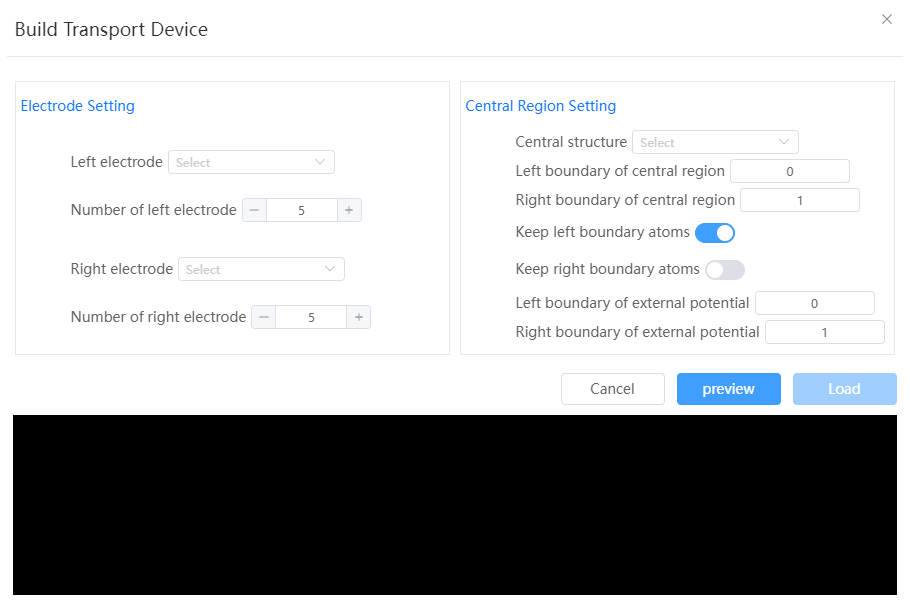

# Build Transport Device

- Electrode Setting
  - Left electrode: must be a structure with lattice
  - Number of left electrode: 3-7, default is 5
  - Right electrode: must be a structure with lattice
  - Number of right electrode: 3-7, default is 5
- Central Region Setting
  - Central structure: must be a structure with lattice
  - Left boundary of central region: When constructing the transport device, the part of the central structure which fractional coordinate is less than this value will be removed
  - Right boundary of central region: When constructing the transport device, the part of the central structure which fractional coordinate is greater than this value will be removed
  - Keep left boundary atoms: When selected, the atoms of the central structure which fractional coordinates are exactly equal to 'left boundary of central region' will be keeped
  - Keep right boundary atoms: When selected, the atoms of the central structure which fractional coordinates are exactly equal to 'right boundary of central region' will be keeped
  - Left boundary of external potential: The left starting position of the bias
  - Right boundary of external potential: Right starting position of the bias

:::tip NOTE：
Note: The stitching direction is along the first lattice basis vector direction. The current direction follows the -a vector direction
:::