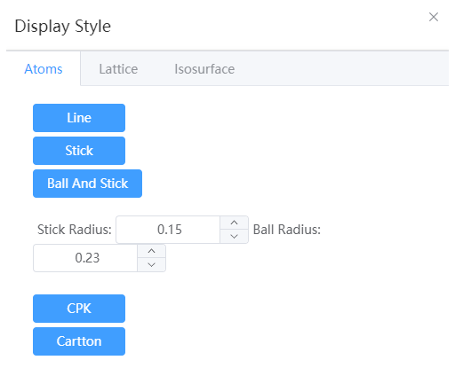
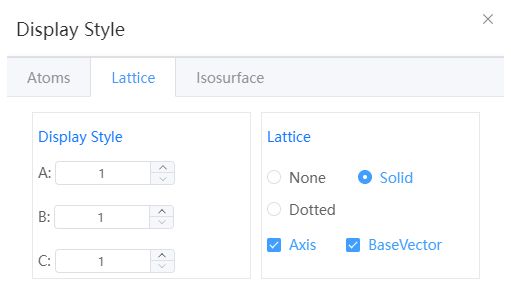
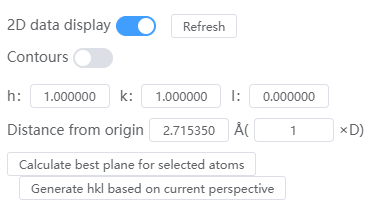

# Display Style

## Atoms

- Line: Hides atoms to represent bonds with lines
- Stick: Hides atoms to represent keys with sticks
- Ball And Stick: Ball for atom, stick for bond; The radius of the ball and stick can be set separately
- CPK: Expressed in CPK models
- Cartoon: Represented in cartoon form, used in protein structures
  
---

## Lattice

- Display Style: shows the structure style repeated in the A, B, and C directions, and only supports periodic structures
  
:::tip NOTE：
Only shown, no real expansion behavior occurred
:::

- Lattice: You can set the lattice to a solid or dotted line, or you can undisplay the lattice
- Axes: Hide or show axes
- Basis Vector: Hide or show lattice basis vector
  
---

## Isosurface

- Maximum and Minimum Values: Displays the maximum and minimum values of the volume data in the current volume data file.
- Mode: Positive, negative, positive and negative can be selected
- Isosurface level: The default is 2*sqrt(variance)+ave, where variance is the variance of the data and ave is the mean of the data
- Color: Specify the color of positive isosurfaces, if both negative or positive and negative modes are selected, negative isosurfaces will be positive inverse.
- Transparency: Adjusts the transparency of the isosurface
- 2D data display: When opened, a 2D volumetric data slice will be displayed

  - Refresh: Each time you change the 2D data display settings, click Refresh to update the 2D slice display
  - Contours: Turn contours on or off
  - hkl: hkl with a 2D slice
  - Distance from origin: The distance of the 2D slice from the origin O in angstroms
  - Calculate best plane for selected atoms: click to update HKL and distance from origin, select at least 3 atoms and above
  - Generate hkl based on current perspective: Click to update HKL and distance from origin
