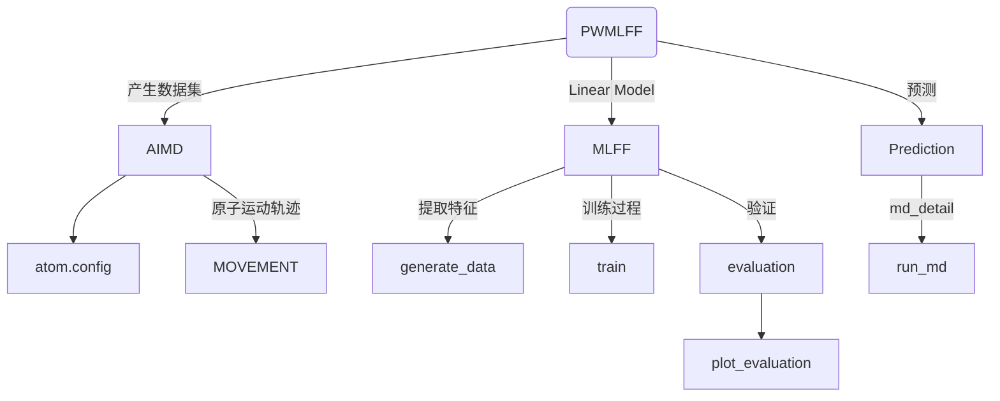
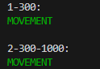
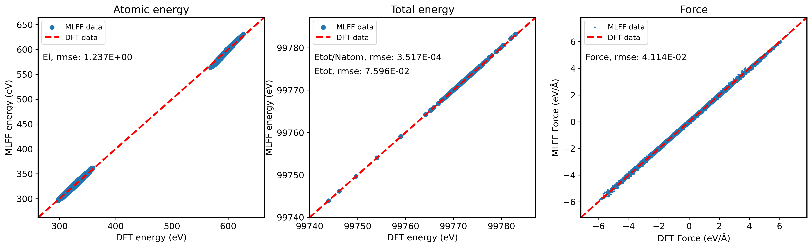

# Bulk SiC system

下文将以 Bulk SiC 系统为例，介绍如何使用 **PWMLFF Linear Model** 进行训练，以及如何使用训练好的模型进行预测。


整个过程分为以下几个步骤：



## 1. 产生数据集

以 PWmat AIMD 模拟得到的 SiC 数据为例，数据文件为`MOVEMENT`，包含 1000 个结构，每个结构包含 216 个原子。

**etot.input**输入文件示例：

```bash
4  1
JOB = MD
MD_DETAIL = 3 1000 1 300 1000
#MD_DETAIL = 3 1000 1 300 300
XCFUNCTIONAL = PBE
Ecut = 50
ECUT2 = 200
MP_N123 = 2 2 2 0 0 0 3
E_ERROR = 0
wg_error = 0
RHO_ERROR = 1E-4
ENERGY_DECOMP = T
IN.ATOM = atom.config
IN.PSP1 = Si.SG15.PBE.UPF
IN.PSP2 = C.SG15.PBE.UPF
```

- 必选项`ENERGY_DECOMP = T`：把总 DFT 能量分解为属于每个原子的能量（原子能量）。结果输出在`MOVEMENT`文件中。
- 其他参数含义参考[PWmat manual](http://www.pwmat.com/pwmat-resource/Manual.pdf)。

## 2. 训练过程

### 2.1 提取特征

新建目录`PWdata`，将`MOVEMENT`文件复制到该目录中。
:::tip
如果有多个`MOVEMENT`文件，需要在`PWdata`目录下分别新建目录（名称任意），并将 `MOVEMENT` 文件分别放入其中。每个目录只能放一个`MOVEMENT`。



:::

### 2.2 训练输入文件

在`PWdata`同级目录下，新建`main.py`文件，执行该文件提取特征并进行训练。

**输入文件示例：**

```python
from PWMLFF.linear_regressor import linear_regressor

if __name__ == "__main__":

    # training
    # atom type to be used
    atom_type = [14,6]
    # feature to be used
    feature_type = [5]
    # create an instance
    linReg = linear_regressor(atom_type = atom_type,
                              feature_type = feature_type,
                              etot_weight = 0.5,
                              force_weight = 0.5,
                              ei_weight = 1.0)
    # generate data
    # ONLY NEED TO BE DONE ONCE
    linReg.generate_data()
    # training
    linReg.train()

```

- `atom_type`：原子类型，14 和 6 分别为 Si 和 C 的原子序数
- `feature_type`：特征类型，5 对应 Moment Tensor Potential，详见[特征类型](./Appendix-1.md)
- `etot_weight`：训练时总能量的权重
- `force_weight`：训练时原子力的权重
- `ei_weight`：训练时原子能量的权重，设置为 0 时表示不训练原子能量

:::tip
以下二个函数可根据实际使用情况选择执行：

- linReg.generate_data() - 用于产生特征，仅需运行一次。例如仅需要针对不同的训练权重进行修改，再重新启动训练时,为了节省时间可以注释掉该行再次执行程序。
- linReg.train() - 用于加载特征,对特征进行处理后开始训练。

:::

### 2.3 运行

以下适用于 Mcloud,提交任务时确保已经加载必要的环境和模块。如`conda activate PWMLFF`。

```bash
#!/bin/sh
#SBATCH --partition=3080ti
#SBATCH --job-name=mlff
#SBATCH --nodes=1
#SBATCH --ntasks-per-node=1
#SBATCH --gres=gpu:1
#SBATCH --gpus-per-task=1

python main.py > log
```

交互式运行：

```bash
$ srun -p 3080ti --gres=gpu:1 --pty /bin/bash
$ python main.py
```

---

程序运行后，会在`PWdata`目录下生成`input`,`output`及`fread_dfeat`目录，同时`PWdata`目录下会产生新的文件：

- **input**

  - location
  - info_dir
  - gen\_\*\_feature.in

- **output**

  - grid\*

- **fread_dfeat**

  - energyL\*
  - feat\*
  - forceL\*
  - linear\*
  - weight_feat.\*

- **PWdata**
  - location
  - dfeat\*
  - info\*
  - trainData\*
  - inquirepos\*
  - MOVEMENTall

## 3. 验证/测试

训练完成后，可以对模型进行验证/测试，以确定模型的拟合效果。

在`PWdata`同级目录下，新建`MD`目录，将另一个的`MOVEMENT`文件复制到该目录中。

:::caution
该 MOVEMENT 文件同样需要在 AIMD 模拟过程中设置`ENERGY_DECOMP = T`，以便提取原子能量。
:::

**验证输入文件示例：**

```python
from PWMLFF.linear_regressor import linear_regressor

if __name__ == "__main__":

    # training
    # atom type to be used
    atom_type = [14,6]
    # feature to be used
    feature_type = [5]
    # create an instance
    linReg = linear_regressor(atom_type = atom_type,
                              feature_type = feature_type,
                              etot_weight = 0.5,
                              force_weight = 0.5,
                              ei_weight = 1.0)

    """
        perform evaulation and plot
    """
    linReg.evaluate()
    linReg.plot_evaluation(plot_elem = False, save_data = False)

```

:::tip

- linReg.evaluate() - 该函数调用`/MD/MOVEMENT`用于验证训练好的模型
- linReg.plot_evaluation() - 用于绘制验证结果图，结果保存在`plot_data`目录下
  - 
  - `plot_elem`: 是否绘制元素能量，默认为`False`。若为`True`，则会绘制每种元素的原子能量
  - `save_data`: 是否保存验证结果，默认为`False`。

:::

## 4. 使用模型进行预测

通过对模型的验证，可以确定模型的拟合效果。在模型拟合效果满意的情况下，可以使用模型进行分子动力学预测。

首先需要准备一个初始构型文件，例如`atom.config`文件。该文件可以不同于训练时的构型文件，但需要保证原子类型与训练时一致。

**输入文件示例：**

```python
from PWMLFF.linear_regressor import linear_regressor

if __name__ == "__main__":

    # training
    # atom type to be used
    atom_type = [14,6]
    # feature to be used
    feature_type = [5]
    # create an instance
    linReg = linear_regressor(atom_type = atom_type,
                              feature_type = feature_type,
                              etot_weight = 0.5,
                              force_weight = 0.5,
                              ei_weight = 1.0)

    # run MD
    # PWmat-style md_detail array
    md_detail = [1,1000,1,500,500]
    linReg.run_md(md_details = md_detail, follow = False)

```

:::tip

- md_detail - 用户必须自行设置的 MD 参数: 1) MD 类型，2) MD 步数，3) MD 步长，4) MD 初始温度，5) MD 终止温度。详细设置请参考[PWmat manual](http://www.pwmat.com/pwmat-resource/Manual.pdf)
- linReg.run_md() - 运行 AIMD 模拟的函数，该函数运行结束后会在当前目录下生成一个新的`MOVEMENT`文件
  - `follow`: 删除旧的 MOVEMENT 文件，默认为`False`。若为`True`，则会在原来的 MOVEMENT 文件上继续追加新的 MD 结果。

:::

---

## 5. All-in-one

以下是一个完整的训练、验证、预测的示例（需要准备好`atom.config`及`MD/MOVEMENT`）：

```python
"""
    example of linear fitting workflow
"""
from PWMLFF.linear_regressor import linear_regressor

if __name__ == "__main__":

    # training
    # atom type to be used
    atom_type = [14,6]
    # feature to be used
    feature_type = [5]
    # create an instance
    linReg = linear_regressor(atom_type = atom_type,
                              feature_type = feature_type,
                              etot_weight = 0.5,
                              force_weight = 0.5,
                              ei_weight = 1.0)
    # generate data
    # ONLY NEED TO BE DONE ONCE
    linReg.generate_data()
    # training
    linReg.train()

    """
        perform evaulation and plot
    """
    linReg.evaluate()
    linReg.plot_evaluation(plot_elem = False, save_data = False)
    # run MD
    # PWmat-style md_detail array
    md_detail = [1,1000,1,500,500]
    linReg.run_md(md_details = md_detail, follow = False)
```
