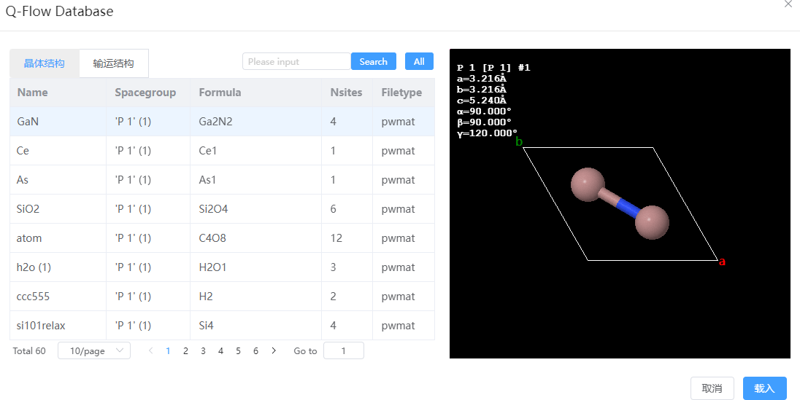
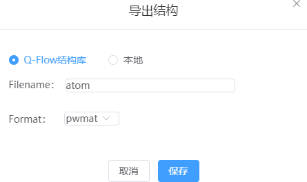

# 文件菜单

- 新建窗口：在结构导航栏新建 New Tab 标签，生成空白的可视化页面并激活
- 本地导入：从本地导入文件，周期性体系支持 `pwmat`、`config`、`cif`、`vasp`、`xsf` 格式；非周期性体系支持`pdb`、`xyz`、`mol`格式；轨迹动画格式支持`xsf`、`MOVEMENT`；电荷密度文件格式支持`xsf`、`jvxl`；振动模式文件格式支持`band.yaml`
- 从在线数据库导入：Materials Project数据库的接口，可根据元素或化学式搜索结构并导入当前窗口
  
- 从Q-Flow数据库导入：Q-Flow结构库的接口，选择结构导入当前窗口

- 导出结构：将当前窗口结构导出
  - Q-Flow结构库：支持导出`pwmat`、`cif`、`vasp`格式
  
  
  - 本地：支持导出`pwmat`、`cif`、`vasp`、`pbd`、`mol`格式
- 导出为图片：将当前窗口的当前视角保存为图片，支持`jpg`、`png`格式

