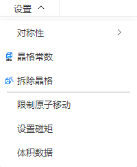

# 设置菜单

<!--  -->
<!--  -->

- [对称性](/1.0/Q-Studio/qstudio_manual_settings_symmetry)
- [晶格常数](/1.0/Q-Studio/qstudio_manual_settings_latticeconstant)
- [新建、拆除晶格](/1.0/Q-Studio/qstudio_manual_settings_newlattice)

---

- [限制原子移动](/1.0/Q-Studio/qstudio_manual_settings_fixatom)
- [设置磁矩](/1.0/Q-Studio/qstudio_manual_settings_magmom)
- [体积数据](/1.0/Q-Studio/qstudio_manual_settings_volumedata)