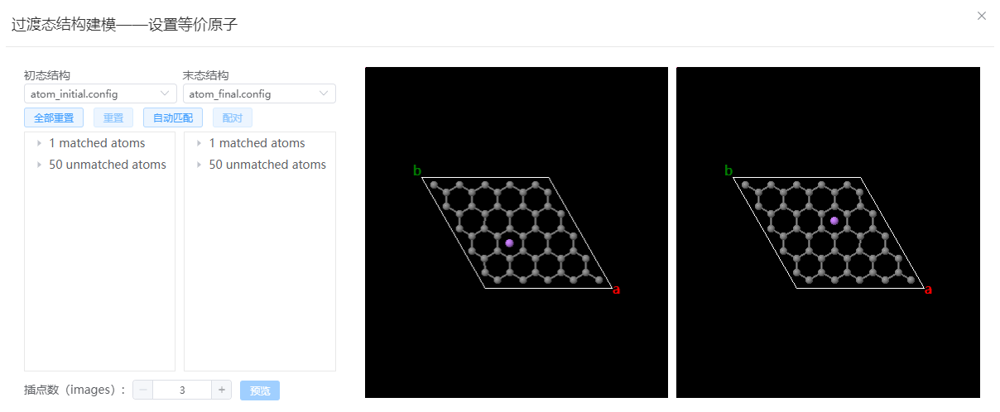
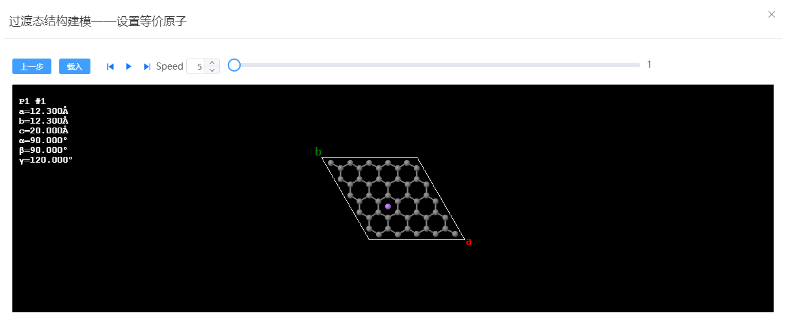

# 过渡态结构建模

以石墨烯上 hollow 位锂原子迁移为例：

1. 将完成结构优化的初态结构和末态结构导入。
   
<table><tr>
    <td> 
        

            
        

    </td>
        <td> 
        

            
        

        </td>
</tr></table>

1. 依次点击`建模`→`过渡态结构建模`，在弹出的窗口内选择初末态结构，点击`自动匹配`，设置插值点数为 5，点击`预览`。
   

2. 点击`播放`观察路径，确认无误后点击`载入`。
   

3. 在新窗口内逐帧微调锂原子的位置
   
