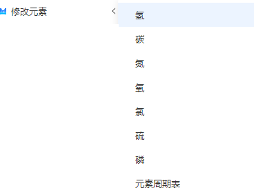
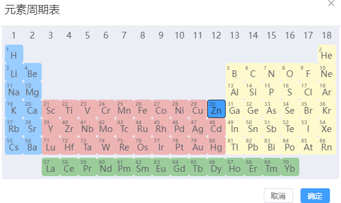

# 建模菜单
<!--  -->

- [新建晶体](./qstudio_manual_build_crystal)
- [构建分子](./qstudio_manual_build_molecule)
- [构建纳米管](./qstudio_manual_build_nanotube)
- [构建纳米团簇](./qstudio_manual_build_nanocluster)
- [构建无序结构](./qstudio_manual_build_packmol)
- [构建异质结构](./qstudio_manual_build_hetero)
- [输运器件建模](./qstudio_manual_build_transport)
- [过渡态结构建模](./qstudio_manual_build_neb)
  
:::tip NOTE：
具体建模操作，请详见[建模示例部分](./qstudio_example)
:::

---

- [添加原子](./qstudio_manual_build_addatom)
- 修改元素：修改已选中原子的元素，支持从元素周期表选择元素
  

- 自动加氢：根据元素和几何位置信息，为选中原子自动添加氢原子

---

- 建立超胞：对有晶格的结构根据周期性边界条件构建超晶胞

- [切表面](./qstudio_manual_build_cleavesurface)

