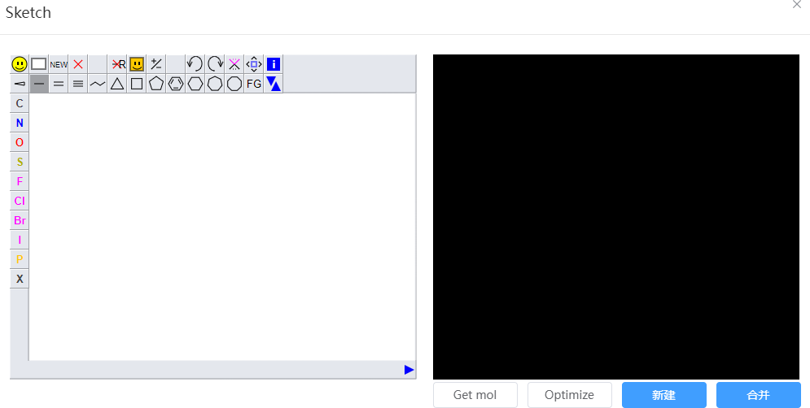

# 构建分子

- 绘制界面：JSME分子绘制工具，访问[JSME官网](https://jsme-editor.github.io/help.html)查看详细说明
- 预览界面：在左侧的JSME界面绘制后，右侧会出现用于预览的可视化模型
- Get mol：将当前小分子导出为`.mol`格式的文件
- Optimize：优化预览界面内的小分子结构并自动加氢
- 新建：在Q-Studio中创建新窗口并将预览界面的小分子导入
- 合并：将预览界面的小分子合并到Q-Studio当前激活窗口内的结构中