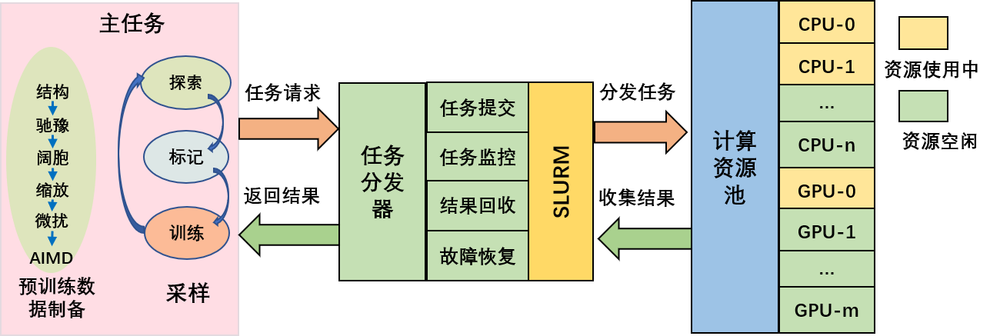
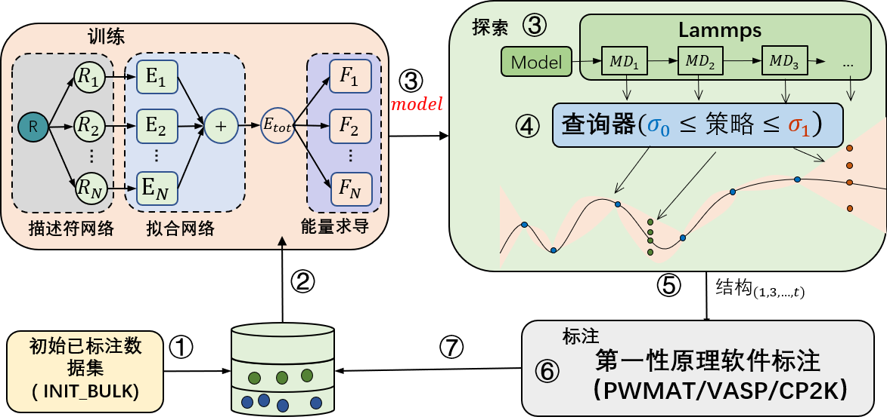

# 主动学习

机器学习力场（Machine learning force filed，MLFF）相比于传统方法，能够更快和精确地预测材料性质和反应机理，当前最先进的基于深度学习的分子动力学已经能够做到百亿原子体系的模拟。但是由于机器学习方法的插值特性，对于训练集之外的相空间，MLFF 很难做出准确预测。由于训练数据通常是使用昂贵的第一性原理计算生成的，现实中很难获取到大量的从头算数据集，生成具有足够代表性的训练数据但不依赖大量从头算数据，对于提升模型的外推能力至关重要。[PWact](https://github.com/LonxunQuantum/PWact) (Active learning based on PWmat Machine Learning Force Field) 是开源的基于 PWMLFF 的一套自动化主动学习平台，用于高效的数据采样。

# PWact

PWact 平台包含主任务和任务分发器两部分，如 [结构图](#Arch_design_slurm) 所示。

主任务包括 `预训练数据制备` 以及 `主动学习` 两个模块。负责预训练数据制备和主动学习过程中的计算任务生成、以及结果收集。任务分发器接收到任务调度请求之后，根据计算资源使用状态以及任务申请资源情况将任务调度到对应的计算节点上，待任务执行完毕之后，收集计算节点的执行结果返回给主任务程序。



### 预训练数据制备模块

包括驰豫 `(支持 PWmat、VASP、CP2K)`、阔胞、缩放晶格、微扰以及运行 MD `(支持 PWmat、VASP、CP2K)` 四个模块，并支持对这些模块的组合使用。

### 主动学习模块



包括`训练`、`构型探索`以及`标注`模块。首先，训练模块做模型训练；之后将训练好的模型送入探索模块。探索模块调用力场模型做分子动力学模拟，模拟结束后把得到的分子运动轨迹送入查询器做不确定性度量；查询完成后，把待标注构型点送入标注模块；最后标注模块做自洽计算，得到能量和力，作为标签与对应构型一起送入已标注数据库中；重复上述步骤，直到收敛。

    1. 对于模型训练，我们这里支持 PWMLFF 中的 DP model、DP model with compress 以及 DP model with type embedding，以及 NEP（NEP4） 模型。

    2. 对于不确定性度量，提供了常用了基于多模型委员会查询的方法，并且也提供了我们最新设计的 单模型的基于卡尔曼滤波的不确定性度量方法 KPU (Kalman Prediction Uncertainty, KPU)。该方法能够在接近委员会查询精度的情况下，将模型训练的计算开销减少到 1/N, N为委员会查询模型数量，欢迎用户尝试。对于 KPU 方法，仅适用于DP模型。

    3. 对于标注，支持 PWmat、VASP、CP2K。

# 依赖应用

1. PWact 作业调度采用 [SLURM](https://slurm.schedmd.com/documentation.html) 集群管理和作业调度系统，需要您的计算集群上已安装 SLURM。

2. PWact 的 DFT 计算支持 [PWmat](https://www.pwmat.com/gpu-download) 、[VASP](https://www.vasp.at/)、 [CP2K](https://www.cp2k.org/)，需要您的计算机群已安装PWMAT、VASP或CP2K。

3. PWact 模型训练基于 [PWMLFF](https://github.com/LonxunQuantum/PWMLFF) , PWMLFF 安装方式参考 [PWMLFF 文档](../Installation.md#pwmlff-编译安装)。

4. PWact Lammps 分子动力学模拟 基于 [Lammps_for_pwmlff](https://github.com/LonxunQuantum/Lammps_for_PWMLFF/tree/libtorch_nep)，安装方式参考 [Lammps_for_pwmlff 文档](https://github.com/LonxunQuantum/Lammps_for_PWMLFF/tree/libtorch_nep/README) 或者 [在线手册](../Installation.md#lammps-for-pwmlff编译安装)

# 安装流程

PWact 支持pip 命令安装与源码安装两种安装方式。

### 1.pip 命令安装
安装包已上传至pypi 官网，支持直接使用pip install 安装。
```bash
    pip install pwact
```

### 2. github源码安装
源码下载
```bash
git clone https://github.com/LonxunQuantum/PWact.git
或者
git clone https://gitee.com/pfsuo/pwact.git
gitee更新可能没有github及时，建议优先从github下载
```

源码下载后，进入源码的根目录（与setup.py同一级）执行命令
```bash
pip install .
#或者加开发者选项, 安装时不复制文件，而是直接从源码文件读取，任何对源码的修改都会立即生效，适用于需要自己修改源码的用户
# pip install -e .
# 从源码安装执行完毕后，需要把pwact加入环境变量
# export PYTHONPATH=/the/path/pwact:$PYTHONPATH
```

PWact 开发语言采用 Python ，支持 Python 3.9 以及以上的版本。建议用户直接使用 PWMLFF 的 [Python 运行环境](http://doc.lonxun.com/PWMLFF/Installation) 即可。

如果您需要为 PWact 单独创建虚拟环境，只需要安装以下依赖包即可（与您的 Python 版本相匹配， 支持Python 3.9 以及以上）。
```bash
    pip install numpy pandas tqdm pwdata
```


# 命令列表

PWact 包括如下命令，起始命令为`pwact`

### 1. 输出可用命令列表

```bash
pwact  [ -h / --help / help ]
```
您也可以用这条命令检查您的PWact是否安装成功
### 2. 输出 cmd_name 对应的参数列表

```bash
pwact cmd_name -h
```

### 3. 初始训练集制备

```bash
pwact init_bulk param.json resource.json
```

### 4. 主动学习

```bash
pwact run param.json resource.json
```

对于上述两个命令，json 文件名称可以用户修改，但是要求 [`param.json`](#paramjson) 和 [`resouce.json`](#resourcejson) 的输入顺序不能变。

### 5. 工具命令
<!-- MOVEMENT 或 OUTCAR 转换为 PWdata 数据格式

```bash
# pwact 转换MOVEMENT 为 pwdata 格式命令
pwact to_pwdata -i mvm_init_000_50 mvm_init_001_50 mvm_init_002_50 -s pwdata -f pwmat/movement -r -m -o 0.8
# -i 结构文件列表
# -f 结构文件格式 支持pwmat/movement 或 vasp/outcar
# -s 保存的目录名称
# -r 指定将数据做乱序保存
# -m 指定合并转换后的数据，如果您的MOVMENT 文件列表元素种类相同和原子数量相同，您可以使用该参数，将训练集作为一个文件夹保存
# -o 指定训练集和测试集划分比例，默认为0.8
``` -->

#### gather_pwdata 命令

搜索主动学习目录下所有探索到的结构，并将结果转换为pwmlff/npy 格式训练集，

```bash
pwact gather_pwdata -i .
```
这里 `-i` 指定主动学习的目录所在路径

#### kill 命令

结束正在执行的 `init_bulk` 任务，如 驰豫（relax）、AIMD 任务

```bash
# 进入到执行 pwact init_bulk 命令时的所在目录
pwact kill init_bulk
```

结束正在执行的 `run` 任务，包括正在运行的训练、探索（MD）或者标记任务
```bash
# 进入到执行 pwact run 命令时的所在目录
pwact kill run
```
上面的 kill 命令功能您也可以通过手动操作替代，需要您第一步，结束正在执行的主进程，即执行 pwact init_bulk 或 pwact run 的窗口；第二步，需要您手动结束正在执行的slurm任务。

考虑到手动操作可能会误结束您的其他进程，建议您使用命令结束。

使用命令结束进程后，建议您查看命令输出信息，并使用 slurm 命令查看是否有未结束的进程。

#### filter 命令

测试指定上、下限设置下的选点情况
```bash
pwact filter -i iter.0000/explore/md -l 0.01 -u 0.02 -s 
```
该命令将检测位于iter.0000/explore/md目录下（该轮次探索到的所有轨迹）使用下限0.01 和上限 0.02 的选点结果(如下面的例子所示)， -s 为可选项，用于指定是否将详细的选点信息做保存。

```txt
Image select result (lower 0.01 upper 0.02):
 Total structures 972    accurate 20 rate 2.06%    selected 44 rate 4.53%    error 908 rate 93.42%

Select by model deviation force:
Accurate configurations: 20, details in file accurate.csv
Candidate configurations: 44
        Select details in file candidate.csv
Error configurations: 908, details in file fail.csv
```

## 输入文件

PWact 包括两个输入文件 `param.json` 和 `resource.json`，用于初始数据集制备或者主动学习。PWact 对于两个 JSON 文件中键的大小写输入不敏感。

### param.json

[初始训练集制备 init_param.josn](./init_param_zh#参数列表)

对构型（VASP、PWmat 格式）进行驰豫、扩胞、缩放、微扰和 AIMD（PWMAT、VASP、CP2K）设置。

[主动学习 run_param.josn](./run_param_zh#参数列表)

主动学习流程中的训练设置（网络结构、优化器）、探索设置（lammps 设置、选点策略）以及标记设置（VASP/PWmat 自洽计算设置）。

### [resource.json](./resource_zh#resourcejson)

计算集群资源设置，包括对训练、分子动力学（MD）、DFT 计算（SCF、Relax、AIMD）使用的计算节点、CPU、GPU 资源设置，以及对应的运行软件（Lammps、VASP、PWMAT、PWMLFF）。

## 主动学习案例

### [硅的主动学习](./example_si_init_zh)
