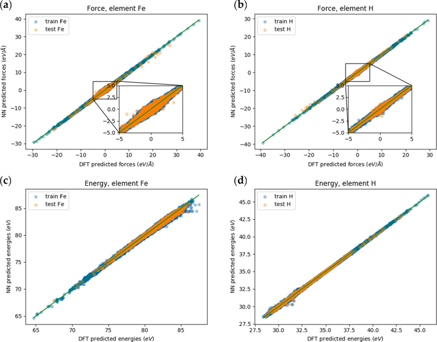
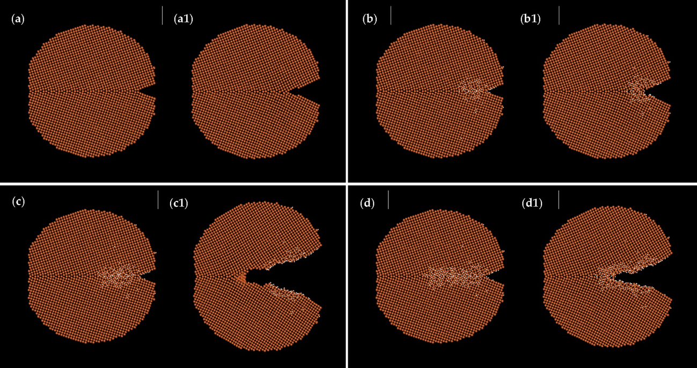
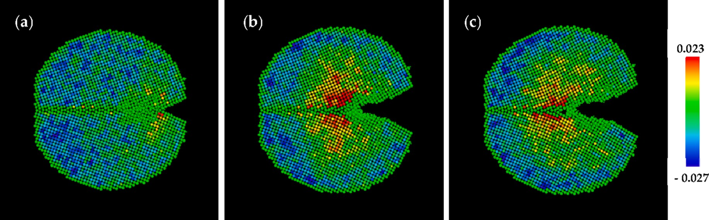
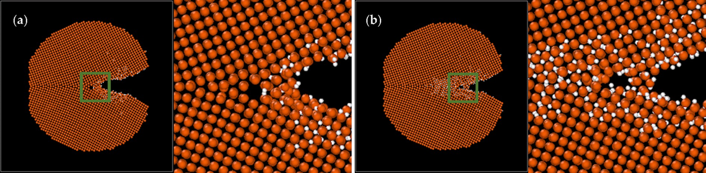

# 6. MLFF for Fe-H system

[[文献 Machine learning force field for Fe-H system and investigation on role of hydrogen on the crack propagation in α-Fe ]](https://www.osti.gov/pages/biblio/1882447-machine-learning-force-field-fe-system-investigation-role-hydrogen-crack-propagation-fe)

案例主要介绍了使用机器学习力场来研究氢对α-铁裂纹传播影响的研究。具体内容包括： 1. 基于密度泛函理论计算结果，构建了铁-氢体系的机器学习力场，该力场采用了神经网络模型，并训练了原子能量。该力场表现出了良好的统计和动力学性质。 2. 通过分子动力学模拟，研究氢浓度对含裂纹的α-铁模型试样裂纹传播的影响。研究发现氢浓度在裂纹尖端处越高，裂纹传播速度越快，这表明氢对裂纹的传播具有促进作用。 3. 在含有晶界的试样中，观察到裂纹尖端处形成了微孔洞，这有助于释放裂纹尖端的拉伸应力，从而促进裂纹的传播。但微孔洞的形成似乎与氢的存在关系不大。 4. 研究还发现，在x方向周期性较短的结构中，裂纹传播速度较快，这可能是由于x方向的协同效应导致的。 5. 与嵌入原子力场的结果相比，机器学习力场显示出了氢对裂纹传播的显著影响，这表明准确描述氢-金属相互作用的力场的重要性。 6. 研究结果表明，氢在裂纹尖端聚集对氢脆性裂纹的传播起着关键作用，需要进一步深入研究不同条件下氢脆性的行为。

# 

模型拟合精度

#

具有倾斜晶界的系统的分子动力学模拟。 (a, a1) 无氢系统的初始和最终框架； (b, b1) 含0.709%总氢浓度的系统的初始和最终框架； (c, c1) 含1.097%总氢浓度的系统的初始和最终框架； (d, d1) 含1.856%总氢浓度的系统的初始和最终框架。

含有1.097%总氢浓度的系统的体积应变分布; (a) 初始框架; (b) 大约6000 fs时的框架。

含有1.097%总氢浓度的系统的体积应变分布; (a) 初始框架; (b) 大约6000 fs的框架。

# 
更多实验结果参考 [文献 Machine learning force field for Fe-H system and investigation on role of hydrogen on the crack propagation in α-Fe ](https://www.osti.gov/pages/biblio/1882447-machine-learning-force-field-fe-system-investigation-role-hydrogen-crack-propagation-fe)