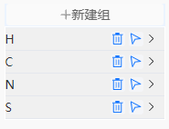
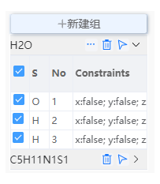
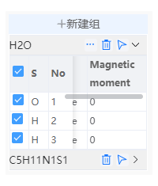

# 建组信息

- 选择一个或多个原子后，可以点击新建组按键为选中的原子创建组。
  

- 输入组名后点击接受，将会在建组信息区域出现新的组。

- 点击将会删除组
- 点击将会在可视化界面快速选中组内全部原子

- 点击建组信息中某个组的，可以展开该组。展开后可以查看该组内原子的元素、序号、固定原子、磁矩信息。

  - 在首行勾选可以在可视化界面选中组内全部原子，也可以分别勾选组内原子使其在可视化界面被选中。
  - 点击可以限制原子移动或设置磁矩，也可以从[限制原子移动弹窗](/next/Q-Studio/界面及功能/菜单/qstudio_manual_settings_fixatom)处或[设置磁矩弹窗](/next/Q-Studio/界面及功能/菜单/qstudio_manual_settings_magmom)处分别设置

:::tip NOTE：
点击快捷结构工具中的可进行整组移动功能
:::

