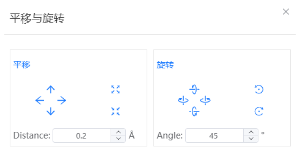

# 快捷结构工具

- ：[新建窗口](./%E8%8F%9C%E5%8D%95/qstudio_manual_file)
- ：[导入结构](./%E8%8F%9C%E5%8D%95/qstudio_manual_file)
- ：[撤销](./%E8%8F%9C%E5%8D%95/qstudio_manual_edit)
- ：[重做](./%E8%8F%9C%E5%8D%95/qstudio_manual_edit)

---

- ：[显示样式](./%E8%8F%9C%E5%8D%95/qstudio_manual_view_display)
- ：选择模式
- ：观察模式
- ：平移模式
- ：选择残基，仅在蛋白质结构生效

---

- ：[查找对称性](./%E8%8F%9C%E5%8D%95/qstudio_manual_settings_symmtry_findsymmetry)
- ：[晶格常数](./%E8%8F%9C%E5%8D%95/qstudio_manual_settings_latticeconstant)
- ：[拆除晶格](./%E8%8F%9C%E5%8D%95/qstudio_manual_settings_newlattice)
- ：[新建晶格](./%E8%8F%9C%E5%8D%95/qstudio_manual_settings_newlattice)

---

- ：[添加原子](./%E8%8F%9C%E5%8D%95/qstudio_manual_build_addatom)
- ：[修改元素](./%E8%8F%9C%E5%8D%95/qstudio_manual_build)
- ：[自动加氢](./%E8%8F%9C%E5%8D%95/qstudio_manual_build)

---

- ：点击进入拖拽原子模式，在原子上按住左键不放可拖拽原子移动
- ：点击进入拖拽分子模式，在分子上按住左键不放可拖拽分子移动
- ：平移与旋转

  - 平移：依据所设置距离，沿当前视角上下左右平移所选原子
  - 旋转：依据所设置角度，以沿当前视角或与当前视角正交的旋转轴旋转所选原子，旋转中心为所选原子的质心
- ：整组移动

  - Move：需要移动的组和移动的基准点，基准点可以为选中组的质心或某一原子
  - To：要移动到的位置，可以是某个组的质心、最佳拟合线、最佳拟合面，也可以是自定义的分数坐标或笛卡尔坐标
- ：依据所设置距离，沿当前视角向上平移所选原子
- ：依据所设置距离，沿当前视角向下平移所选原子
- ：依据所设置距离，沿当前视角向左平移所选原子
- ：依据所设置距离，沿当前视角向右平移所选原子

---

- ：

  - 计算化学键：该工具默认选项
  - 化学键选项：

    - From：原子间的距离小于理想键长（依据共价半径）乘From系数时，不会形成化学键
    - To：原子间的距离大于理想键长（依据共价半径）乘To系数时，不会形成化学键
  - 删除化学键：删除所选原子间的所有化学键；若未选中原子，则删除结构中所有化学键
  - 监测成键：勾选时在进行任何原子的操作后会自动监测是否形成化学键
- ：计算氢键
- ：删除结构中所有键
- ：修改所选原子的成键类型，可以为单键、部分双键、双键、三键

---

- ：测量距离
- ：测量角度
- ：测量二面角
- ：清除测量值

:::tip NOTE：
将鼠标悬浮在对应的图标上以显示对应功能
:::
