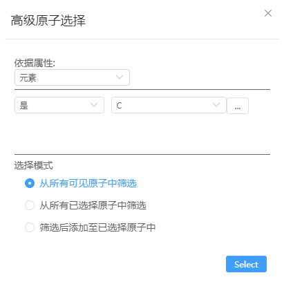

# 高级原子选择

- 依据属性：
  - 元素：依据是或不是某种元素筛选出所有符合要求的原子；依据是其中之一或不是其中之一筛选出所有符合要求的原子，可选择多种元素
  - 磁矩：依据磁矩大小筛选出所有符合要求的原子
  - 分数坐标：依据分数坐标筛选出所有符合要求的原子
  - 笛卡尔坐标：依据笛卡尔坐标筛选出所有符合要求的原子
  - 径向距离：依据选种原子质心或某一位置的径向距离筛选出所有符合要求的原子
  - Chain：仅支持蛋白质结构
- 选择模式：
  - 从所有可见原子中筛选：默认选项
  - 从所有已选择原子中筛选
  - 筛选后添加至已选择原子中