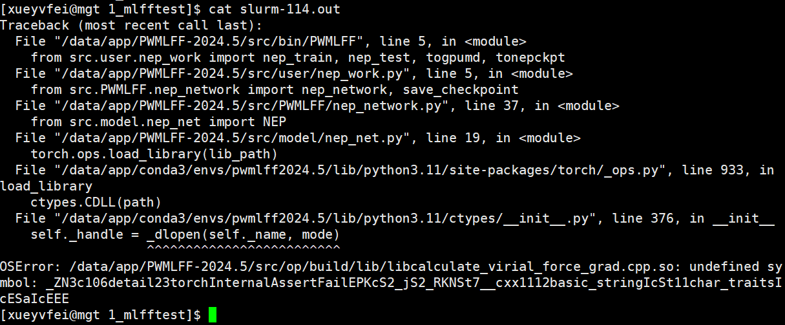

# Install Error

## 关于编译环境
大部分的安装失败问题，都来源于编译安装环境版本不匹配，或找不到相关环境变量。请先检查下列编译器是否已正确安装，并且版本适配。

我们推荐使用 `intel2020`版本，`cuda/11.8`，`cmake版本 >= 3.21`，`gcc 版本 8.n`。
PWMLFF中使用的`pytorch`版本为`2.0`以上，必须使用 `cuda/11.8`或更高版本。

对于 `intel/2020`编译套件，使用了它的 `ifort` 和 `icc` 编译器(`19.1.3`)、`mpi(2019)`、`mkl库(2020)`，如果单独加载，请确保版本不低于它们。

您可以通过位于源码根目录的src/check_env.sh 脚本检查环境。一个正确的环境如下所示。
``` txt
1. CUDA version is 11.8.
2. nvcc command exists.
3. ifort version is no less than 19.1, current version is 19.1.
4. MKL library is installed.
5. GCC version is not 8.x, current version is 8.
6. PyTorch is installed.
7. PyTorch version is 2.0 or above, current version is 2.2.
```
## 1. OSError

### 环境描述
操作系统`rocky8.5`，`cmake 2.30.0`，`gcc8.5`或者`gcc9.2`，`cuda/11.8`，`intel/2020`，`pytroch 2.2.0.dev20231127+cu118`， `PWMLFF2024.5`

### 错误描述

该错误发生在操作系统 rocky8.5 ( Ubuntu 也可能存在该问题)上，按照安装说明正常完成 PWMLFF2024.5 编译之后，在提交任务训练时发生如下所示的错误。

OSError: /PWMLFF2024.5/src/op/build/lib/libcalculate_virial_force_grad.cpp.so: undefined symbol: _ZN3c106detail23torchInternalAssertFailEPKcS2_jS2_RKNSt7__cxx1112basic_stringIcSt11char_traitsIcESaIcEEE



### 解决方法
在源码目录 /PWMLFF2024.5/src/op 下，修改 CMakeLists.txt，取消对第一行的注释（去掉`#`字符）
```txt
add_compile_options(-D_GLIBCXX_USE_CXX11_ABI=0)
```

### 错误原因
该错误是‌std::string ABI不匹配造成的。
‌std::string ABI‌主要涉及到C++标准库中的std::string类在不同编译器ABI（Application Binary Interface，应用程序二进制接口）下的兼容性问题。ABI定义了程序在二进制层面的规范，包括函数调用的约定、数据类型的布局、异常处理机制等，是编译器、操作系统和硬件共同决定的接口。由于C++的ABI比C语言更复杂，因为它依赖于编译器，因此在使用不同编译器或编译器不同版本编译的程序之间，可能会出现ABI不兼容的情况。
对于Centos 系统，pip安装了pytroch之后，libtorch的_GLIBCXX_USE_CXX11_ABI宏被设置为1，在编译c++ cuda的算子时使用的是1，相匹配。但是在 rocky8.5 或者 Ubuntu 系统，libtorch的宏是0，不再匹配，因此编译后发生该错误。需要手动在CMakelist.txt中指定为0。


