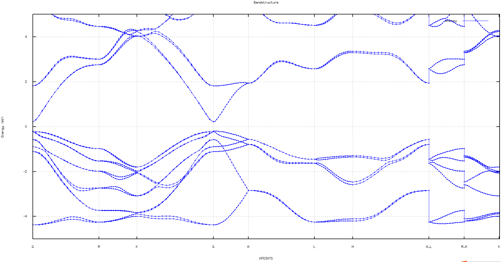

# Spin-orbit coupling bandstructure calculation without magnetic moment

Spin-orbit coupling bandstructure calculation without magnetic moment for GaAs

There are two steps, the first step is SCF calculation, and the second is NONSCF calculation.

## First Step: SCF calculation

### Input files

atom.config

```dotnetcli
     4
 LATTICE
      4.38647521     0.00000000     0.00000000
     -2.19323810     3.79879878     0.00000000
      0.00000000     0.00000000     7.15850229
 POSITION
  34     0.66666667     0.33333333     0.87584179 1 1 1
  34     0.33333333     0.66666667     0.37584179 1 1 1
  48     0.66666667     0.33333333     0.50004945 1 1 1
  48     0.33333333     0.66666667     0.00004945 1 1 1
```

etot.input

```dotnetcli
 1  4
 JOB = SCF
 IN.PSP1 = Cd.SG15.PBE.SOC.UPF
 IN.PSP2 = Se.SG15.PBE.SOC.UPF
 IN.ATOM = atom.config
 CONVERGENCE = difficult
 SPIN = 22
 Ecut = 50
 Ecut2 = 100
 MP_N123 = 12 12 5 0 0 0
 XCFUNCTIONAL = PBE
```

:::tip

1.  Spin: specifies spin polarization, 22:Spin-orbit coupling, but without magnetic moment.
2.  CONVERGENCE: control the convergence parameters of the SCF self-consistent iteration, possible values: easy or difficult.

:::

Cd.SG15.PBE.SOC.UPF, Se.SG15.PBE.SOC.UPF
:::tip

Spin-orbit pseudopotential files need to be used.

:::

### Calculations

1. You can submit PWmat tasks in different ways:

```dotnetcli
   mpirun -np 4 PWmat | tee output
```

:::tip Note
Run the command directly
:::

```dotnetcli
   #!/bin/bash
   #PBS -N SCF
   #PBS -l nodes=1:ppn=4
   #PBS -q batch
   #PBS -l walltime=100:00:00

   ulimit -s unlimited
   cd $PBS_O_WORKDIR

   mpirun -np 4 PWmat | tee output
```

:::tip Note
Submit the task with a pbs script
:::

## Second Step: NONSCF calculation

### Input files

atom.config

```dotnetcli
     4
 LATTICE
      4.38647521     0.00000000     0.00000000
     -2.19323810     3.79879878     0.00000000
      0.00000000     0.00000000     7.15850229
 POSITION
  34     0.66666667     0.33333333     0.87584179 1 1 1
  34     0.33333333     0.66666667     0.37584179 1 1 1
  48     0.66666667     0.33333333     0.50004945 1 1 1
  48     0.33333333     0.66666667     0.00004945 1 1 1
```

etot.input

```dotnetcli
 1  4
 JOB = NONSCF
 IN.PSP1 = Cd.SG15.PBE.SOC.UPF
 IN.PSP2 = Se.SG15.PBE.SOC.UPF
 IN.ATOM = atom.config
 SPIN = 22
 Ecut = 50
 Ecut2 = 100
 XCFUNCTIONAL = PBE
 IN.VR = T
 IN.KPT = T
```

:::tip Note

1.  Read IN.VR from previous SCF calculation. To copy OUT.VR and OUT.FERMI from the SCF calculation to your current working drectory and rename IN.VR.
2.  IN.KPT is the k-points file which PWmat will use for band structure calculation, one can use "split_kp.x" utility to get it. You should prepare an input file for "split_kp.x", which can be named "gen.kpt":

```dotnetcli
BAND                    # COMMENT line
20                      # number of k-points between G and M
0.000  0.000  0.000  G  # reciprocal coordinates; label 'G' for Gamma point
0.500  0.000  0.000  M
20
0.500  0.000  0.000  M
0.333  0.333  0.000  K
20
0.333  0.333  0.000  K
0.000  0.000  0.000  G
20
0.000  0.000  0.000  G
0.000  0.000  0.500  A
20
0.000  0.000  0.500  A
0.500  0.000  0.500  L
20
0.500  0.000  0.500  L
0.333  0.333  0.500  H
20
0.333  0.333  0.500  H
0.000  0.000  0.500  A
20
0.500  0.000  0.500  L
0.500  0.000  0.000  M
20
0.333  0.333  0.500  H
0.333  0.333  0.000  K
```

```dotnetcli
split_kp.x gen.kpt
```

After running "split_kp.x gen.kpt", it will generate "IN.KPT" and "HIGH_SYMMETRY_POINT" (high-symmetry points information) files.

:::

Cd.SG15.PBE.SOC.UPF, Se.SG15.PBE.SOC.UPF

:::tip
Spin-orbit pseudopotential files need to be used.
:::

### Calculations

1. You can submit PWmat tasks in different ways:

```dotnetcli
   mpirun -np 4 PWmat | tee output
```

:::tip Note
Run the command directly
:::

```dotnetcli
   #!/bin/bash
   #PBS -N SCF
   #PBS -l nodes=1:ppn=4
   #PBS -q batch
   #PBS -l walltime=100:00:00

   ulimit -s unlimited
   cd $PBS_O_WORKDIR

   mpirun -np 4 PWmat | tee output
```

:::tip Note
Submit the task with a pbs script
:::

2. After NONSCF calculation, you can run "plot_band_structure.x" to obtain band structure in your current working directory. Then it will generate the following files: bandstructure.eps, bandstructure.png, bandstructure.pdf and bandstructure_1.txt (the data
file of band structure), which can be used to plot band by  *origin* or *gnuplot*. 

```dotnetcli
   plot_band_structure.x
```

