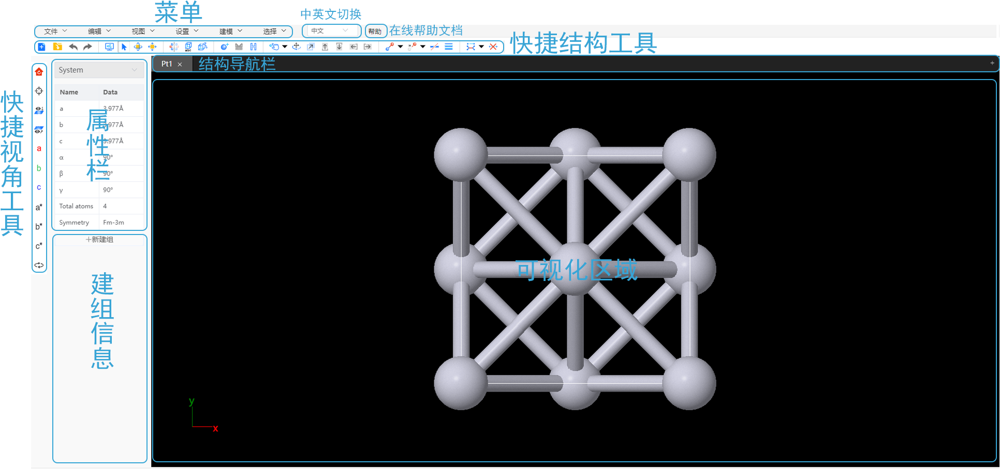

# 界面及功能

- [菜单](/next/Q-Studio/界面及功能/菜单)
- [快捷结构工具](/next/Q-Studio/界面及功能/qstudio_structtools)
- [快捷视角工具](/next/Q-Studio/界面及功能/qstudio_visiontools)
- [结构导航栏](/next/Q-Studio/界面及功能/qstudio_navigation)
- [可视化区域](/next/Q-Studio/界面及功能/qstudio_visualization)
- [属性栏](/next/Q-Studio/界面及功能/qstudio_property)
- [建组信息](/next/Q-Studio/界面及功能/qstudio_addgroup)
- 在线帮助文档：链接到此文档
- 中英文切换

