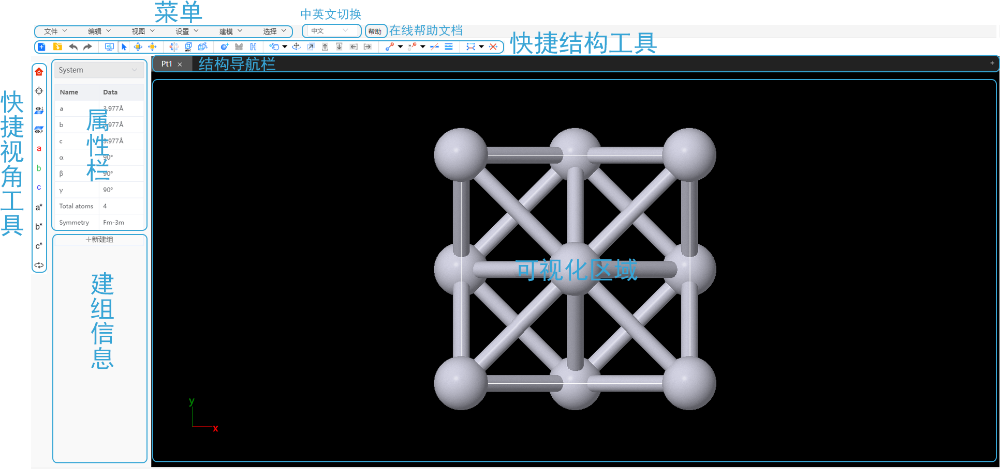

# 界面及功能

- [菜单](界面及功能/菜单)
- [快捷结构工具](界面及功能/qstudio_structtools)
- [快捷视角工具](界面及功能/qstudio_visiontools)
- [结构导航栏](界面及功能/qstudio_navigation)
- [可视化区域](界面及功能/qstudio_visualization)
- [属性栏](界面及功能/qstudio_property)
- [建组信息](界面及功能/qstudio_addgroup)
- 在线帮助文档：链接到此文档
- 中英文切换

