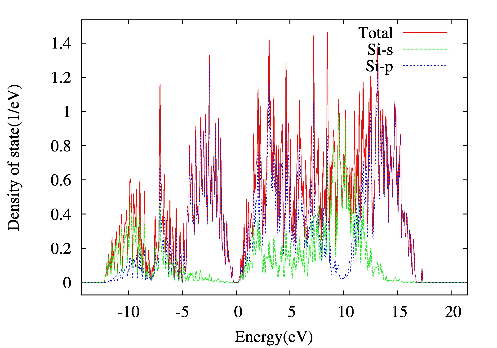

# DOS calculation

DOS calculation for Si

## Input files

atom.config

```dotnetcli
        2
 LATTICE
      0.00000000     2.71535000     2.71535000
      2.71535000     0.00000000     2.71535000
      2.71535000     2.71535000     0.00000000
 POSITION
  14     0.00000000     0.00000000     0.00000000 0 0 0
  14     0.25000000     0.25000000     0.25000000 0 0 0
```

etot.input

```dotnetcli
   1 4
   JOB = DOS
   IN.PSP1 = Si.SG15.PBE.UPF
   IN.ATOM = atom.config
   ECUT = 50
   MP_N123 = 9 9 9 0 0 0
   IN.WG = T
```

:::tip Note
   1. Read IN.WG from previous SCF calculation. To copy OUT.WG from the SCF calculation of example `Si SCF Calculation <Si_SCF_Calculation.html>`_ to your current working drectory and rename IN.WG.
   2. You also need copy OUT.EIGEN and OUT.FERMI from the SCF calculation of example `Si SCF Calculation <Si_SCF_Calculation.html>`_ to your current working drectory.
   3. For large systems, you can first do a scf calculation with a small number of k points, then increase the number of k points for the NONSCF calculation. DOS calculation is performed with the output (OUT.WG and OUT.EIGEN) of NONSCF.

```dotnetcli
      1 4
      JOB = NONSCF
      IN.PSP1 = Si.SG15.PBE.UPF
      IN.ATOM = atom.config
      Ecut = 50
      MP_N123 = 15 15 15 0 0 0
      IN.VR = T
```

To copy OUT.VR from the SCF calculation of example `Si SCF Calculation <Si_SCF_Calculation.html>`_ to your current working drectory and rename IN.VR.

```dotnetcli
      1  4
      JOB = DOS
      IN.PSP1 = Si.SG15.PBE.UPF
      IN.ATOM = atom.config
      Ecut = 50
      MP_N123 = 15 15 15 0 0 0
      IN.WG = T
```
To copy OUT.WG from the previous NONSCF calculation to your current working drectory and rename IN.WG.
:::

Si.SG15.PBE.UPF

:::tip Note
   Si.SG15.PEB.UPF is the pseudopotential file.
:::

## Calculations

1.You can submit PWmat tasks in different ways:

```dotnetcli
   mpirun -np 4 PWmat | tee output
```
:::tip Note
   Run the command directly
:::

---

```dotnetcli
   #!/bin/bash
   #PBS -N SCF
   #PBS -l nodes=1:ppn=4
   #PBS -q batch
   #PBS -l walltime=100:00:00

   ulimit -s unlimited
   cd $PBS_O_WORKDIR
   
   mpirun -np 4 PWmat | tee output
```

:::tip Note
   Submit the task with a pbs script
:::

2. The DOS data can be found in DOS.totalspin file, you can plot itW with *origin* or *gnuplot*. We provide a Python script to plot DOS.totalspin.

```bash
   plot_DOS.py
```



## Download

[Si_DOS_Cal](http://doc.lonxun.com/Examples/examples/Si_DOS_Cal.tar.gz)