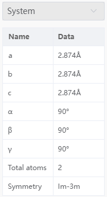

# 属性栏

## 系统

- `a` `b` `c` `α` `β` `γ`：显示当前窗口结构的晶格常数。若无晶格，则全部为none
- `Total atoms`：显示当前窗口结构的总原子数
- `Symmetry`：显示当前窗口结构的空间群。若无晶格，则为none

## 原子

- `元素符号`：显示选中原子的元素符号；可点击修改元素，也可以从`建模菜单`→`修改元素`处修改，也可以从快捷结构工具中点击修改
- `No.`：显示选中原子在当前结构中的序号(index)
- `FXYZ`：显示选中原子的分数坐标，若无晶格，则全部为空；可点击修改分数坐标
- `XYZ`：显示选中原子的笛卡尔坐标；可点击修改笛卡尔坐标
- `固定原子`：显示选中原子是否被固定；true为固定，false为未固定；可点击设置，也可以从[限制原子移动弹窗](/next/Q-Studio/界面及功能/菜单/qstudio_manual_settings_fixatom)处设置
- `磁矩`：显示选中原子的磁矩；可点击设置磁矩，也可以从[设置磁矩弹窗](/next/Q-Studio/界面及功能/菜单/qstudio_manual_settings_magmom)处设置
- `颜色`：显示选中原子的颜色；可点击修改颜色