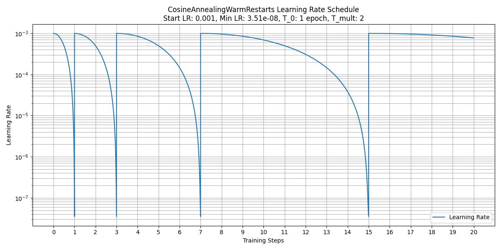

# MatPL 可用参数

本节介绍了所有模型中可由用户定义的参数，可以分为基础参数和高级参数两类。基础参数需要用户指定，高级参数采用了默认值，用户可以在 json 文件中根据需求手动修改。在下面的参数中，"相对路径（relative path）" 表示相对于当前工作目录的路径，而 "绝对路径（absolute path）" 表示从根目录开始的文件或目录的完整路径。

## 基础参数

对于 MatPL 中的力场，只需要设置以下基础参数即可开始训练。

### model_type
该参数用于指定用于训练的模型类型。您可以使用`LINEAR`模型、`NN`模型、`DP`模型或 `NEP` 模型。

### atom_type
该参数用于设置训练体系的元素类型。用户可以按照任意顺序指定元素的原子序数。例如，对于单元素系统如铜，可以设置为 [29]，而对于多元素系统如 CH4，则可以设置为 [1, 6]。您也可以使用元素类型的名称，例如["Cu"] 或者 ["H", "C"]。

### train_data
该参数用于指定训练集数据路径。您可以使用相对路径或绝对路径。
   - 对于 DP 和 NEP 模型，支持的文件格式有`extxyz` 、`pwmlff/npy`、`deepmd/npy`、`deepmd/raw`、`pwmat/movement`, `vasp/outcar`, `cp2k/md`
   - 对于 LINEAR 和 NN 模型，仅支持`pwmat/movement`格式

### valid_data
该参数用于指定验证集数据路径。您可以使用相对路径或绝对路径。
   - 对于 DP 和 NEP 模型，支持的文件格式有`extxyz` 、`pwmlff/npy`、`deepmd/npy`、`deepmd/raw`、`pwmat/movement`, `vasp/outcar`, `cp2k/md`
   - 对于 LINEAR 和 NN 模型，仅支持`pwmat/movement`格式

### test_data
该参数用于`test`命令做推理时指定测试集数据路径。您可以使用相对路径或绝对路径。
   - 对于 DP 和 NEP 模型，支持的文件格式有`extxyz` 、`pwmlff/npy`、`deepmd/npy`、`deepmd/raw`、`pwmat/movement`, `vasp/outcar`, `cp2k/md`
   - 对于 LINEAR 和 NN 模型，仅支持`pwmat/movement`格式

### format
该参数用于指定数据（`train_data`、`valid_data`、`test_data`）的格式，支持的数据格式有扩展的xyz格式 `extxyz` 、`pwmlff/npy`、`deepmd/npy`、`deepmd/raw`格式。此外也支持直接使用 PWmat, VASP, CP2K 轨迹文件， 对应 `format` 参数分别为 `pwmat/movement`, `vasp/outcar`, `cp2k/md`。默认格式为 `pwmat/movement`。细节请参考数据格式转换工具[`pwdata`](./pwdata/README.md)。
:::info
注意，输入数据的格式需要一致。
:::

### model_load_file
该参数用于`test`命令做推理时指定模型的路径，支持相对或者绝对路径。

### recover_train
该参数用于从中断的训练任务中恢复训练。默认值为 `true`

### reserve_work_dir
该参数用于LINEAR 或者 NN 模型，用于指定在任务执行完成后是否保留工作目录 `work_dir`。默认值为 `False`，意味着在执行完成后该目录将被删除。
<!-- ### max_neigh_num
MatPL 会扫描训练集自动计算最大邻居数量。对于某些体系来说，这个值可能不足以容纳所有的邻居，导致特征生成失败。在这种情况下，将会弹出以下警告信息：

```txt
Error! maxNeighborNum too small
```
在该情况下，请调大该值。 -->

## 模型超参数

用户只需要设置必要参数即可完成模型的训练、测试和相关分子动力学过程。相应的高级参数，如模型超参数和优化器超参数，将被设置为默认值。MatPL的可设置模型超参数如下。


### NEP model

完整的 NEP 模型参数设置如下：

```json
    "model": {
        "descriptor": {
            "cutoff": [6.0,6.0],
            "n_max": [4,4],
            "basis_size": [12,12],
            "l_max": [4,2,1],
            "zbl": 2.0
        },
        "fitting_net": {
            "network_size": 40
        }
    }
```

#### cutoff
该参数用于设置 `radial` 和 `angular` 的截断能。默认值为 `[8.0, 4.0]`。

#### n_max
该参数用于设置 `radial` 和 `angular`分别对应的描述符数量，该值不小于0，不大于 19，默认值为 `[4, 4]`。

#### basis_size
该参数用于设置 `radial` 和 `angular`对应的基组数量，该值不小于0，不大于 19默认值为 `[8, 8]`。

#### l_max
该参数用于设置 angular 的展开阶，同时控制是否使用四体和五体描述符，默认值为 `[4, 2, 1]`，分别是三体、四体以及五体 描述符 对应的阶。这里 `2`表示使用四体 描述符，`1` 表示使用五体描述符。如果您只使用三体描述符，请设置为`[4, 0, 0]`；只是用三体和四体描述符，请设置为`[4, 2, 0]`。

:::info
NEP 两体描述符的数量为 n_max[0]+1；三体描述符的数量为 (n_max[1] + 1)*l_max[0]，四体描述符、五体描述符数量相同，分别为 n_max[1] + 1。
:::

#### network_size
该参数用于设置 `NEP` 模型中隐藏层神经元个数，在 NEP 模型中只有一层隐藏层，默认值为 `40`。
<!-- 这里支持使用多层神经网络，如您可以设置为`[50, 50, 50, 1]`这类网络，但是建议您使用默认值即可，更多网络层数在我们的测试中对模型拟合精度的提升有限，反而会造成推理负担，降低推理速度。 -->

#### zbl
该参数用于设置Ziegler-Biersack-Littmark (ZBL) 势，处理原子距离非常近的情况。默认不设置。该值的允许范围是 1.0 $\le$ zbl $\le$ 2.5。

### DP model

DP 模型的完整参数设置如下：

```json
    "type_embedding":false,
    "model": {
        "type_embedding":{
            "physical_property":["atomic_number", "atom_mass", "atom_radius", "molar_vol", "melting_point", "boiling_point", "electron_affin", "pauling"]
        },
        "descriptor": {
            "Rmax": 6.0,
            "Rmin": 0.5,
            "M2": 16,
            "network_size": [25,25,25]
        },
        "fitting_net": {
            "network_size": [50,50,50,1]
        }
    }
```

#### type_embedding
该参数用于 DP 模型训练开启type embedding时设置相应参数。您也可以在'model'同级字典下设置`"type_embedding":true`，此时将采用 ["atomic_number", "atom_radius", "atom_mass", "electron_affin", "pauling"]设置。默认值为`false`，不开启type_embdding。

##### physical_property

该参数用于指定 `DP` 模型在做 type embedding 方式训练时需要的参数，我们这里提供了 8 个物理属性供用户选择。

    - atomic_number: 原子序数
    - atom_mass: 原子质量
    - atom_radius: 原子半径
    - molar_vol: 摩尔体积
    - melting_point: 熔点
    - boiling_point: 沸点
    - electron_affin: 电子亲和能
    - pauling 为泡林电负性

    "physical_property" 默认值为 ["atomic_number", "atom_radius", "atom_mass", "electron_affin", "pauling"]

#### Rmax
DP 模型中平滑函数的最大截断半径。默认值为 $6.0 \text{\AA}$。

#### Rmin
DP 模型中平滑函数的最小截断半径。默认值为 $0.5 \text{\AA}$。

#### M2
该参数用于 DP 模型中的网络，确定嵌入网络的输出大小和拟合网络的输入大小。在示例中，嵌入网络的输出大小为(25 X 16)，拟合网络的输入大小为(25 X 16 = 400)。默认值为 16。

#### network_size
该参数用于嵌入网络（embedding_net）和拟合网络（fitting_net）的结构。默认值分别为[25, 25, 25]和[50, 50, 50, 1]。对应的网络结构如下所示：

嵌入网络的结构：
输入层（输入数据维度）➡ 隐藏层 1（25 个神经元）➡ 隐藏层 2（25 个神经元）➡ 输出层 3（25 个神经元）

拟合网络的结构：
输入层（M2 X 25）➡ 隐藏层 1（50 个神经元）➡ 隐藏层 2（50 个神经元）➡ 隐藏层 3（50 个神经元）➡ 输出层（1 个神经元）

### NN model

NN 模型的完整参数设置如下：

```json
    "model": {
        "descriptor": {
            "Rmax": 6.0,
            "Rmin": 0.5,
            "feature_type": [3,4]
        },
        "fitting_net": {
            "network_size": [15,15,1]
        }
    }
```

#### Rmax
特征的最大截断半径。默认值为 $6.0 \text{\AA}$。

#### Rmin
特征的最小截断半径。默认值为 $0.5 \text{\AA}$。

#### feature_type
该参数用于特征类型。支持的选项有[1, 2]、[3, 4]、[5]、[6]、[7]和[8]。默认值为[3, 4]，即 2-b 和 3-b 高斯特征。有关不同特征类型的更详细信息，请参考[附录1](./models/nn/README.md)。

#### network_size
该参数用于拟合网络（fitting_net）的结构。默认值为[15, 15, 1]，其结构如下所示：
输入层（输入数据维度）➡ 隐藏层 1（15 个神经元）➡ 隐藏层 2（15 个神经元）➡ 输出层（1 个神经元）


### Linear model

Linear 模型的完整参数设置如下：

```json
    "model": {
        "descriptor": {
            "Rmax": 6.0,
            "Rmin": 0.5,
            "feature_type": [3,4]
        }
    }
```

#### Rmax
特征的最大截断半径。默认值为 $6.0 \text{\AA}$。

#### Rmin
特征的最小截断半径。默认值为 $0.5 \text{\AA}$。

#### feature_type
该参数用于特征类型，与`NN 模型`中的设置相同。支持的选项有[1, 2]、[3, 4]、[5]、[6]、[7]和[8]。默认值为[3, 4]，即 2-b 和 3-b 高斯特征。有关不同特征类型的更详细信息，请参考[附录1](./models/nn/README.md)。

## optimizer 优化器

可用于训练 NN、DP、NEP 模型的优化器，有`KF（Kalman Filter）优化器`和`ADAM 优化器`。

### ADAM optimizer

ADAM 优化器的完整参数设置如下:

```json
    "optimizer": {
        "optimizer": "ADAM",
        "epochs": 30,
        "batch_size": 1,
        "print_freq": 10,
        "lambda_2" : 0.1,
        "learning_rate": 0.001,
        "stop_lr": 3.51e-08,
        "stop_step": 1000000,
        "decay_step": 5000,
        "train_energy": true,
        "train_force": true,
        "train_ei": false,
        "train_virial": false,
        "train_egroup": false,
        "start_pre_fac_force": 1000,
        "start_pre_fac_etot": 0.02,
        "start_pre_fac_virial": 50.0,
        "end_pre_fac_force": 1.0,
        "end_pre_fac_etot": 1.0,
        "end_pre_fac_virial": 1.0
    }
```

#### optimizer
该参数用于指定优化器名称，默认为`ADAM`。对 LKF 优化器，指定名称为 `'LKF'`。关于优化器的详细信息参考 [LKF](https://dl.acm.org/doi/abs/10.1609/aaai.v37i7.25957)，其中提供了有关优化器实现和特性的更深入的细节说明。

#### epochs
该参数用于指定训练的轮数（epochs）。在机器学习中，一个 epoch 指的是整个训练数据集通过神经网络的完整传递，包括前向传播和反向传播。在每个 epoch 中，训练数据集分为多个 `小批量（mini-batches）` 样本，之后把每个批次输入到神经网络，进行前向传播、损失计算和参数更新的反向传播过程。训练的轮数决定了整个训练数据集在训练过程中被处理的次数。默认值为 `30`。

通常需要通过调试和评估训练过程来选择适当的训练轮数。如果训练轮数过小，模型可能无法充分学习数据集的模式和特征，导致欠拟合。另一方面，如果训练轮数过大，模型可能会过拟合训练数据，在新数据上的泛化性能下降。

#### batch_size
批大小（batch size）参数确定了在每个 epoch 的训练过程中，每个小批量（mini-batch）中包含的训练样本数量。默认值为 `1`。

#### print_freq
该参数用于指定每经过多少个`小批量`迭代之后打印一次训练误差。默认值为 `10`。

#### train_energy
该参数用于指定是否训练 total energy，默认值为 `true`。

#### train_force
该参数用于指定是否训练 force，默认值为 `true`。

#### train_virial
该参数用于指定是否训练 virial，默认值为 `false`。

#### lambda_2
该参数用于设置 Adam 优化器的 `L2` 正则化项，默认不设置。设置正则化项有助于减少模型的过拟合。

#### learning_rate
该参数是 Adam 优化器的初始学习率。默认值为 `0.001`。

#### stop_lr
该参数是指停止学习率，表示当学习率降到该值时学习率将停止更新，后续训练学习率为该值。默认值为 `3.51e-08`。

#### stop_step
该参数是指停止步数（stopping step），表示当达到该步数时学习率将停止更新，此时学习率值等于 stop_lr 指定的值。stop_step 默认值为 `1000000`。

#### decay_step
该参数表示衰减步数（decay step），它指定了学习率衰减的间隔。在每个衰减步数之后，学习率会根据一定的衰减率进行更新。默认值为 `5000`。

`learning_rate`, `stop_lr`, `stop_step`, `decay_step` 这四个变量用于更新学习率，其计算过程如下所示，可以使用以下的 Python 代码或数学公式表示：

```python
decay_rate = np.exp(np.log(stop_lr/learning_rate) / (stop_step/decay_step))
real_lr = learning_rate * np.power(decay_rate, (iter_num//decay_step))
```

首先计算衰减率（decay_rate）：

$$
\text{decay\_rate} = \exp\left(\frac{\log(\text{stop\_lr}/\text{start\_lr})}{\text{stop\_step}/\text{decay\_step}}\right)
$$

更新学习率 learning rate：

$$
\text{real\_lr} = \text{start\_lr} \cdot \left(\mathrm{decay\_rate}\right)^{\left(\left\lfloor\frac{\text{iter\_num}}{\text{decay\_step}}\right\rfloor\right)}
$$

其中，iter_num 代表训练过程中的迭代次数。

#### start_pre_fac_force
训练开始时 force 损失的 prefactor，应大于或等于 0。默认值为 `1000`。

#### start_pre_fac_etot
训练开始时 total energy 损失的 prefactor，应大于或等于 0。默认值为 `0.02`。

#### start_pre_fac_virial
训练开始时 virial 损失的 prefactor，应大于或等于 0。默认值为 `50.0`。

<!-- #### start_pre_fac_egroup
训练开始时 egroup 损失的 prefactor，应大于或等于 0。默认值为 `0.02`。

#### start_pre_fac_ei
训练开始时 atomic energy 损失的 prefactor，应大于或等于 0。默认值为 `0.1`。 -->

#### end_pre_fac_force
训练结束时 force 损失的 prefactor，应大于或等于 0。默认值为 `1.0`。

#### end_pre_fac_etot
训练结束时 total energy 损失的 prefactor，应大于或等于 0。默认值为 `1.0`。

#### end_pre_fac_virial
训练结束时 virial 损失的 prefactor，应大于或等于 0。默认值为 `1.0`。

<!-- #### end_pre_fac_egroup
训练结束时 egroup 损失的 prefactor，应大于或等于 0。默认值为 `1.0`。

#### end_pre_fac_ei
训练结束时 atomic energy 损失的 prefactor，应大于或等于 0。默认值为 `2.0`。 -->

#### max_norm & norm_type (按范数裁剪)
参数 max_norm 和 norm_type 配合使用，用于设置按照范数裁剪梯度。

计算所有参数梯度的范数，如果超过max_norm，则按比例缩放梯度使范数等于max_norm。

作用：保持梯度方向的相对关系（所有梯度同比例缩放）；适合防止梯度爆炸的同时保留梯度间的平衡；norm_type可选（如L2范数、L1范数等）。

norm_type 取值为 1或 2，1 表示用 L1 范数，2 表示用 L2 范数。

max_norm 为 浮点值。

#### clip_value (按值裁剪)
参数 max_norm 和 norm_type 配合使用，按值裁剪梯度。直接将所有梯度元素裁剪到[-clip_value, clip_value]区间，超过阈值的梯度被截断。

作用：粗暴但高效，不保持梯度比例关系; 计算开销更小（无需计算范数）; 可能导致梯度方向剧烈变化。

#### t_0 & t_mult
参数 t_0 和 t_mult 配合使用，用于设置在 ADAM 优化器中使用余弦退火算法更新学习率。注意：启用了余弦退火后，学习率的更新由调度器 optim.lr_scheduler.CosineAnnealingWarmRestarts 完全接管，在[decay_step](#decay_step)中的学习率更新策略将失效。

- T_0 学习率第一次回到初始值的epoch位置；
- T_mult 控制学习率变化的速度。如果T_mult=1,则学习率在T_0,2T_0,3T_0,....,i*T_0,....处回到最大值(初始学习率)；如果T_mult>1,则学习率在T_0,(1+T_mult)T_0,(1+T_mult+T_mult**2)T_0,.....,(1+T_mult+T_mult2+...+T_0i)*T0,处回到最大值。

如下图所示，该例中[初始学习率 learning_rate](#learning_rate) 为 0.001，T_0 = 1, T_mult = 2, [最小学习率 stop_lr](#stop_lr) = 3.51e-08。



### KF optimizer

KF 优化器的完整参数设置如下：

```json
    "optimizer": {
        "optimizer": "LKF",
        "epochs": 30,
        "batch_size": 1,
        "print_freq": 10,
        "block_size": 5120,
        "p0_weight": 0.01,
        "kalman_lambda": 0.98,
        "kalman_nue": 0.9987,
        "train_energy": true,
        "train_force": true,
        "train_virial": false,
        "pre_fac_force": 2.0,
        "pre_fac_etot": 1.0,
        "pre_fac_virial": 1.0
    }
```

`optimizer`, `epochs`, `batch_size`, `print_freq`, `train_energy`, `train_force`,  `train_virial` 参数与 ADAM 优化器中的参数功能相同。

#### block_size
该参数是`LKF 优化器`的超参数，用于指定协方差矩阵 P 的块大小。较大的块大小会增加内存和 GPU 内存的消耗，导致训练速度较慢，而较小的块大小会影响收敛速度和准确性。默认值为 `5120`，如果是在 A100、H100 等高端显卡上，建议设置为 `10240`。

#### p0_weight
该参数是 `LKF`的超参数，用于正则化参数，默认值为`0.01`，即采用正则化。设置正则化项有助于减少模型的过拟合。该参数要求值小于 `1` ，经过测试 `0.01` 是较为合适的值。如果设置为 `1` 则表示不适用正则化。

#### kalman_lambda
该参数是`LKF`的超参数，称为记忆因子（memory factor）。它决定了对先前数据的权重或关注程度。值越大，越重视先前的数据。默认值为 `0.98`。

#### kalman_nue
该参数是`LKF`的超参数，kalman_nue 是遗忘率（forgetting rate），描述了 kalman_lambda 变化的速率。默认值为 `0.9987`。

<!-- #### train_ei
该参数用于指定是否训练 atomic energy，默认值为 `false`。 -->

<!-- #### train_egroup
该参数用于指定是否训练 energy group，默认值为 `false`。 -->

#### pre_fac_etot
该参数用于指定 total energy 对损失函数的权重或贡献。默认值为 `1.0`。

#### pre_fac_force
该参数用于指定 force 对损失函数的权重或贡献。默认值为 `2.0`。

#### pre_fac_virial
该参数用于指定 virial 对损失函数的权重或贡献。默认值为 `1.0`。

<!-- #### pre_fac_ei
该参数用于指定 atomic energy 对损失函数的权重或贡献。默认值为 `1.0`。

#### pre_fac_egroup
该参数用于指定 energy group 对损失函数的权重或贡献。默认值为 `0.1`。 -->

