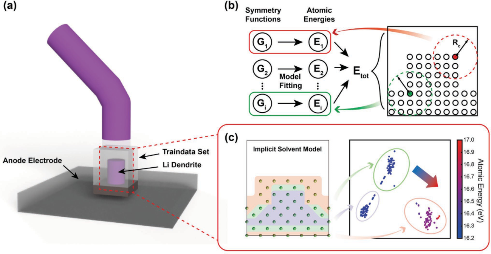
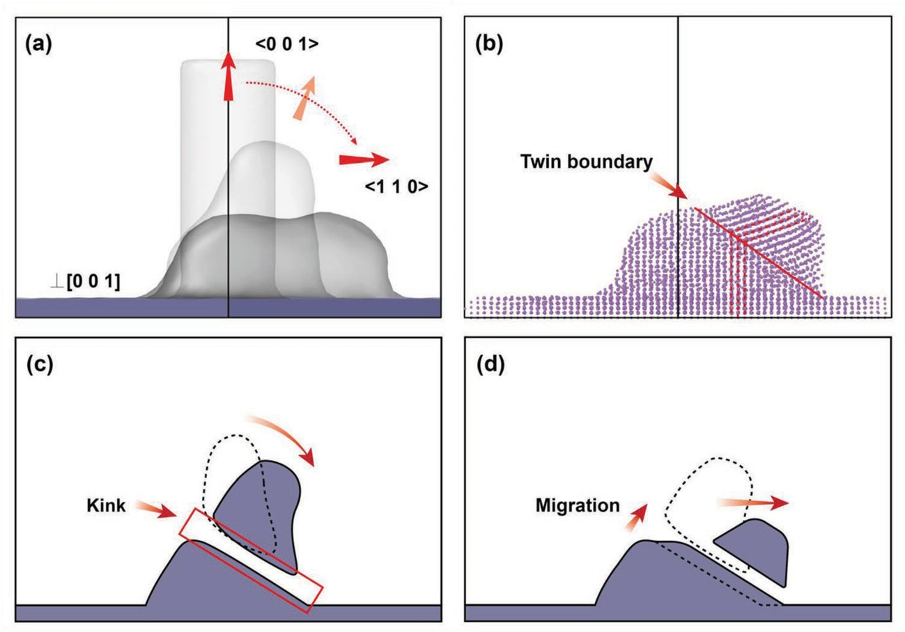

# Morphology Evolution of Lithium Dendrites

案例细节可以参考 [[龙讯公众号文章]](https://mp.weixin.qq.com/s/kapzIrPvL2AcGTUzdHgglg) 以及 [[文献 Revealing Morphology Evolution of Lithium Dendrites by Large-Scale Simulation Based on Machine Learning Force Field ]](https://iopscience.iop.org/article/10.1088/1367-2630/acf2bb)

锂离子电池具有高能量密度特性，在电动汽车、大规模储能系统等领域得到了广泛应用。锂金属负极由于同时具备最低化学势与高容量特性，有望成为下一代更高比能量密度电池中的重要组成部分。然而，在循环充放电中，锂金属负极易出现枝晶生长问题和体积剧烈变化问题，严重影响了锂金属负极的应用。在实际工作环境中，锂枝晶生长会大大降低电池的库仑效率、能量密度与稳定性。当枝晶生长到一定长度之后，还会刺穿隔膜，从而直接与正极接触，造成短路，可能导致火灾等严重事故。因此在锂金属负极材料的开发中，解决枝晶生长的问题至关重要。

随着实验技术的发展，锂枝晶的具体形态与相结构可由透射电子显微镜(TEM)直接观测。然而，受现有观测方法的分辨率限制，枝晶形态演化的动力学过程目前仍不甚清晰。现有的模拟研究则通常采用相场与经验力场方法，这些方法精度稍差，难以预测枝晶的实际形态特征，因此非常有必要发展原子级别精度的方法来做大规模形态模拟。

基于量子化学计算的机器学习方法提供了一个兼顾计算精度与速度的方案，这种机器学习力场模型通过训练高精度的小系统数据集得到，在碱金属以及其他材料上有望模拟到介观甚至宏观的尺度。此外，训练机器学习力场的势能面数据可以来自多种密度泛函理论计算，如隐式电解质环境中的锂原子计算，这使得人们有望在真实环境中模拟锂枝晶的演化过程。

本案例 采用基于 `机器学习力场（MatPL）` 的分子动力学方法，模拟了在电解质环境中锂枝晶的形态演化过程，揭示了锂枝晶生长机制，对于推动锂金属负极材料的应用具有重要意义。

### 结合DFT精度原子能标签，加速模型构建

(a) 小尺度枝晶数据集构成（b）MLFF模型结构（c）体心立方结构剖面图与特征-原子能关系可视化分析

### 针对跨尺度力场应用的主动学习与验证方案

跨尺度模拟主动学习法示意图。（a）主动学习拓展模型中的数据采样示意图（b）机器学习力场-分子动力学中发生变化的关键部分截取采样（c）截取部分由DFT计算数据集重新训练模型

### 不同初始构型枝晶的形态演化过程与驱动力分析

 圆柱形结构的形态演化过程

不同暴露面下矩形体结构的形态演化过程