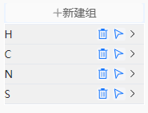
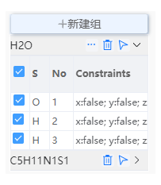
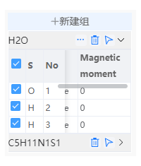

# 原子组

- ：选择一个或多个原子后，可以点击新建组按键为选中的原子创建原子组。

- 输入组名后点击接受，将会在建组信息区域出现新的组。

- 点击将会删除组
- 点击将会在可视化界面快速选中组内全部原子

- 点击建组信息中某个组的，可以展开该组。展开后可以查看该组内原子的元素、序号、固定原子、磁矩信息。

  - 在首行勾选可以在可视化界面选中组内全部原子，也可以分别勾选组内原子使其在可视化界面被选中。
  - 点击下的选项打开[限制原子移动](./%E5%B7%A5%E5%85%B7/qstudio_manual_settings_fixatom.md)工具或[设置磁矩](./%E5%B7%A5%E5%85%B7/qstudio_manual_settings_magmom.md)工具

- ：打开[整组移动](./%E5%B7%A5%E5%85%B7/qstudio_manual_movegroup.md)工具

