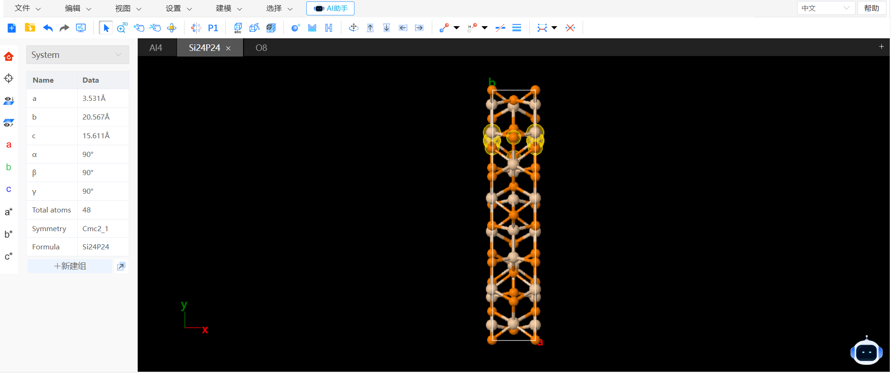

# 界面及功能

- [菜单](./菜单/README.md)
- [工具](./工具/README.md)
- [快捷结构工具](./qstudio_structtools.md)
- [快捷视角工具](./qstudio_visiontools.md)
- [结构导航栏](./qstudio_navigation.md)
- [可视化区域](./qstudio_visualization.md)
- [属性栏](./qstudio_property.md)
- [建组信息](./qstudio_addgroup.md)
- 在线帮助文档：链接到此文档
- 中英文切换

