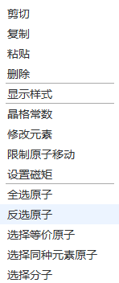

# 弹出菜单

可快速执行操作，或打开相应工具，包括：
- 剪切、复制、粘贴、删除原子
- [显示样式](./工具/qstudio_manual_view_display.md)
- [晶格常数](./工具/qstudio_manual_settings_latticeconstant.md)
- [限制原子移动](./工具/qstudio_manual_settings_fixatom.md)
- [设置磁矩](./工具/qstudio_manual_settings_magmom.md)
- 全选原子、选择等价原子、选择同种元素原子、选择分子