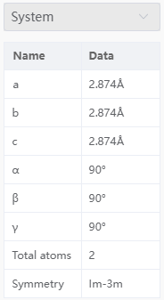
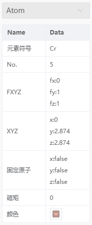

# 属性栏

## 系统

- `a` `b` `c` `α` `β` `γ`：显示当前窗口结构的晶格常数。若无晶格，则全部为none。点击打开[晶格常数](./%E5%B7%A5%E5%85%B7/qstudio_manual_settings_latticeconstant.md)工具
- `Total atoms`：显示当前窗口结构的总原子数
- `Symmetry`：显示当前窗口结构的空间群。若无晶格，则为none。点击打开[查找对称性](./%E5%B7%A5%E5%85%B7/qstudio_manual_settings_symmtry_findsymmetry.md)工具

## 原子

- `元素符号`：显示选中原子的元素符号；点击打开[修改元素](./%E5%B7%A5%E5%85%B7/qstudio_modify_element.md)工具
- `No.`：显示选中原子在当前结构中的序号(index)
- `FXYZ`：显示选中原子的分数坐标，若无晶格，则全部为空；可点击修改该原子分数坐标
- `XYZ`：显示选中原子的笛卡尔坐标；可点击修改该原子笛卡尔坐标
- `固定原子`：显示选中原子是否被固定；true为固定，false为未固定；点击打开[限制原子移动](./%E5%B7%A5%E5%85%B7/qstudio_manual_settings_fixatom.md)工具
- `磁矩`：显示选中原子的磁矩；点击打开[设置磁矩](./%E5%B7%A5%E5%85%B7/qstudio_manual_settings_magmom.md)工具
- `颜色`：显示选中原子的颜色；可点击修改颜色