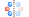

# 快捷操作按钮（结构）

- ：[新建窗口](./%E8%8F%9C%E5%8D%95/qstudio_manual_file.md)
- ：[本地导入](./%E8%8F%9C%E5%8D%95/qstudio_manual_file.md)
- ：[撤销](./%E8%8F%9C%E5%8D%95/qstudio_manual_edit.md)
- ：[恢复](./%E8%8F%9C%E5%8D%95/qstudio_manual_edit.md)
- ：[显示样式](./%E5%B7%A5%E5%85%B7/qstudio_manual_view_display.md)

---

- ：激活[选择模式](./qstudio_visualization.md#选择模式)
- ：激活[观察模式](./qstudio_visualization.md#观察模式)
- ：激活[拖拽原子模式](./qstudio_visualization.md#拖拽原子模式)
- ：：激活[拖拽分子模式](./qstudio_visualization.md#拖拽分子模式)
- ：激活[旋转原子模式](./qstudio_visualization.md#旋转原子摸式)
- ：激活[绘制原子模式](./qstudio_visualization.md#绘制原子模式)
- ：选择残基，仅在蛋白质结构生效

---

- ：打开[查找对称性](./%E5%B7%A5%E5%85%B7/qstudio_manual_settings_symmtry_findsymmetry.md)工具
- ：[Make P1（取消对称性）](./%E8%8F%9C%E5%8D%95/qstudio_manual_setting.md#makep1)
---

- ：打开[晶格常数](./%E5%B7%A5%E5%85%B7/qstudio_manual_settings_latticeconstant.md)工具
- ：[拆除晶格](./%E8%8F%9C%E5%8D%95/qstudio_manual_setting.md#breaklattice)
- ：打开[新建晶格](./%E5%B7%A5%E5%85%B7/qstudio_manual_settings_newlattice.md)工具
- ：打开[建立超胞](./%E5%B7%A5%E5%85%B7/qstudio_build_supercell.md)工具

---

- ：打开[添加原子](./%E5%B7%A5%E5%85%B7/qstudio_manual_build_addatom.md)工具
- ：打开[修改元素](./%E5%B7%A5%E5%85%B7/qstudio_manual_build.md)工具
- ：[自动加氢](./%E8%8F%9C%E5%8D%95/qstudio_manual_build.md#addhydrogen)

---

- ：打开[平移与旋转](./%E5%B7%A5%E5%85%B7/qstudio_manual_translate_and_rotate.md)工具
- ：依据所设置距离，沿当前视角向上平移所选原子
- ：依据所设置距离，沿当前视角向下平移所选原子
- ：依据所设置距离，沿当前视角向左平移所选原子
- ：依据所设置距离，沿当前视角向右平移所选原子

---

- ：
  - 计算化学键
  - 化学键选项：打开[化学键选项](./%E5%B7%A5%E5%85%B7/qsutdio_bond_connect.md)工具
  - 删除化学键：删除所选原子间的所有化学键；若未选中原子，则删除结构中所有化学键
  - 监测成键：勾选时在新建原子、原子位置改变后会自动成键。可在播放轨迹动画时生效
- ：计算氢键
- ：删除结构中所有键
- ：修改所选原子的成键类型，可以为单键、部分双键、双键、三键

---

- ：激活[测量距离模式](./qstudio_visualization.md#测量【距离/角度/扭转】模式)
- ：激活[测量角度模式](./qstudio_visualization.md#测量【距离/角度/扭转】模式)
- ：激活[测量扭转模式](./qstudio_visualization.md#测量【距离/角度/扭转】模式)
- ：清除测量值

:::tip NOTE：
鼠标悬浮在按钮上可查看按钮名称
:::
