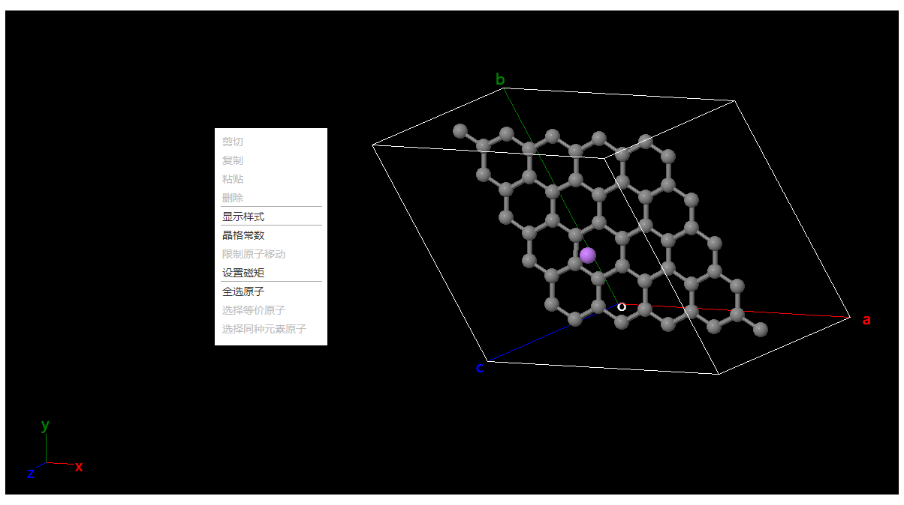

# 可视化区域

提供交互式操作界面，详细介绍各模式下的鼠标、键盘交互方法

## 通用操作
- `↑` `↓` `←` `→` `Shift + ←` `Shift + →`：旋转视角，旋转的角度在[平移与旋转](./%E5%B7%A5%E5%85%B7/qstudio_manual_translate_and_rotate.md)弹窗中定义
- `鼠标滚轮`：缩放视角
- `Ctrl+z`：撤销操作
- `Ctrl+y`：恢复操作
- `Ctrl+c`：复制原子
- `Ctrl+v`：粘贴原子
- `Delete`：删除选中原子

## 选择模式

- 在原子上`left-click`：选中单个原子
- 在空白处`left-click`：取消选中
- `left-drag`：框选
- 在原子上`left-double-click`：选中分子
- 在原子上`Ctrl+left-click`：连续选中原子
- 在原子上`Ctrl+left-double-click`：连续选中分子
- `right-click`：[弹出菜单](./qstudio_popupmenu.md)
- `right-drag`：旋转视角
- `Ctrl+left-drag` `Shift+left-drag` `Ctrl+right-drag`：平移视角
- `Shift+right-drag`：绕z轴旋转视角

## 观察模式

- 在原子上`left-click`：选中单个原子
- 在空白处`left-click`：取消选中
- 在原子上`left-double-click`：选中分子
- 在原子上`Ctrl+left-click`：连续选中原子
- `right-click`：[弹出菜单](./qstudio_popupmenu.md)
- `left-drag`：平移视角
- `right-drag`：旋转视角
- `Ctrl+left-drag` `Shift+left-drag`：框选
- `Ctrl+right-drag`：平移视角
- `Shift+right-drag`：绕z轴旋转视角

## 拖拽原子模式
### 未选中原子时
- 在原子上`left-drag`：平移单个原子
- 在空白处`left-drag`：平移视角
- `right-drag`：旋转视角
- `Ctrl+left-drag` `Shift+left-drag` `Ctrl+right-drag`：平移视角
- `Shift+right-drag`：绕z轴旋转视角
  
### 选中原子时
- 在原子上`left-drag`：仅平移选中原子
- 在空白处`left-drag`：平移视角
- 在原子上`right-drag`：旋转选中原子（不包含等价原子时）
- 在空白处`right-drag`：旋转视角
- `Ctrl+left-drag` `Shift+left-drag` `Ctrl+right-drag`：平移视角
- `Shift+right-drag`：绕z轴旋转视角

## 拖拽分子模式
### 未选中原子时
- 在原子上`left-drag`：平移原子所属的单个分子
- 在空白处`left-drag`：平移视角
- `right-drag`：旋转视角
- `Ctrl+left-drag` `Shift+left-drag` `Ctrl+right-drag`：平移视角
- `Shift+right-drag`：绕z轴旋转视角

### 选中原子时
- 在原子上`left-drag`：平移选中原子所属的所有分子
- 在空白处`left-drag`：平移视角
- 在原子上`right-drag`：旋转选中原子所属的所有分子（不包含等价原子时）
- 在空白处`right-drag`：旋转视角
- `Ctrl+left-drag` `Shift+left-drag` `Ctrl+right-drag`：平移视角
- `Shift+right-drag`：绕z轴旋转视角

## 旋转原子摸式
不可旋转的等价原子将会被固定
### 未选中原子时
- 在原子上`left-drag`：旋转原子所属的单个分子
- 在空白处`left-drag`：旋转视角
- 在原子上`right-drag`：平移原子所属的单个分子
- 在空白处`right-drag`：平移视角
- `Ctrl+left-drag` `Shift+left-drag` `Ctrl+right-drag`：平移视角
- `Shift+right-drag`：绕z轴旋转视角

### 选中原子时
- 在原子上`left-drag`：旋转选中原子所属的所有分子
- 在空白处`left-drag`：旋转视角
- 在原子上`right-drag`：平移选中原子所属的所有分子
- 在空白处`right-drag`：平移视角
- `Ctrl+left-drag` `Shift+left-drag` `Ctrl+right-drag`：平移视角
- `Shift+right-drag`：绕z轴旋转视角

<!-- ## 绘制原子模式
- 在原子上`left-click`：修改元素为所选元素
- 在原子上`left-drag`：绘制新原子，元素为所选元素
- 在空白处`left-drag`：平移视角
- `right-drag`：旋转视角
- `Ctrl+left-drag` `Shift+left-drag` `Ctrl+right-drag`：平移视角
- `Shift+right-drag`：绕z轴旋转视角 -->

## 测量距离/角度/扭转模式
- 在原子上`left-click`：开始/结束测量
- `left-drag`：平移视角
- `right-drag`：旋转视角、
- `Ctrl+left-drag` `Shift+left-drag` `Ctrl+right-drag`：平移视角
- `Shift+right-drag`：绕z轴旋转视角