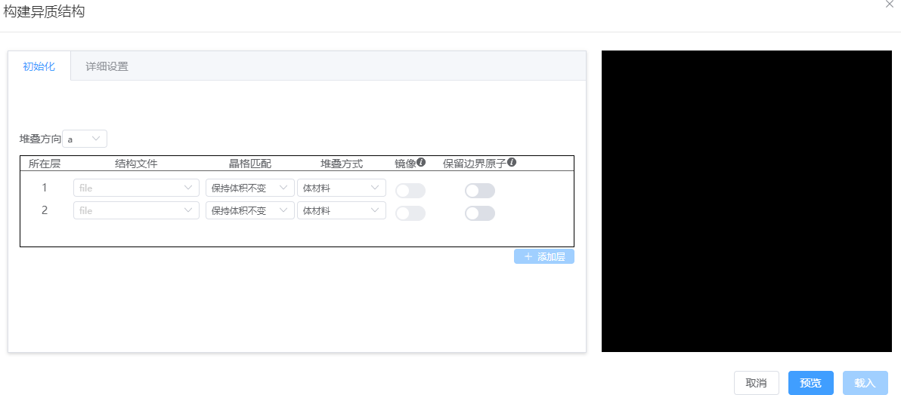
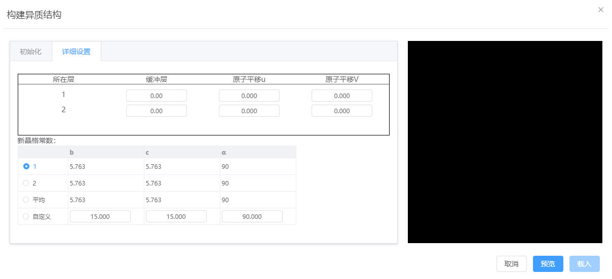

# 构建异质结构(superlattice)
支持将2-3个晶格匹配的结构沿指定方向堆叠，提供晶格调整、堆叠方式选择、镜像操作和边界原子保留等功能，并可设置缓冲层和原子平移

- 初始化
  - 堆叠方向：可以为`a`, `b`, `c`；沿所选方向按所在层依次堆叠结构
  - 结构文件：需选择有晶格的结构
  - 晶格匹配：在拼接结构时，将调整结构晶格。可以选择`保持体积不变`或`保持厚度不变`
  - 堆叠方式：
    - 当晶格匹配为`保持体积不变`时，堆叠方式必须为`体材料`，结构的体积（密度）不变
    - 当晶格匹配为`保持厚度不变`时，堆叠方式可以为`体材料`、`二维材料`、`孤立体系`。`体材料`则结构中原子层的间距不变；`二维材料`则去掉堆叠方向真空层，同时原子层间距不变；`孤立体系`则去掉所有真空层，同时原子间距不变。
  - 镜像：堆叠前结构沿堆叠方向进行镜像操作，要求堆叠方向与另外两矢量方向正交。如：堆叠方向为`a`时，要求β=γ=90°，此时结构以`bc`平面做镜像操作
  - 保留边界原子：保留结构沿堆叠方向的边界上的所有原子。如：堆叠方向为`a`时，保留所有分数坐标为(0.0, y, z), (1.0, y, z)的原子。

- 详细设置
  - 缓冲层：堆叠后，添加一段缓冲距离（真空）
  - 原子平移UV：堆叠前，将结构内所有原子在垂直堆叠方向的平面内进行分数坐标的平移
  - 新晶格常数：异质结构的晶格常数
    - 堆叠方向为`a`时：需要确定`b`, `c`, `α`的数值，`a`根据计算得到，`β`, `γ`将会取各结构的平均值
    - 堆叠方向为`b`时：需要确定`c`, `a`, `β`的数值，`b`根据计算得到，`γ`, `α`将会取各结构的平均值
    - 堆叠方向为`c`时：需要确定`a`, `b`, `γ`的数值，`c`根据计算得到，`α`, `β`将会取各结构的平均值