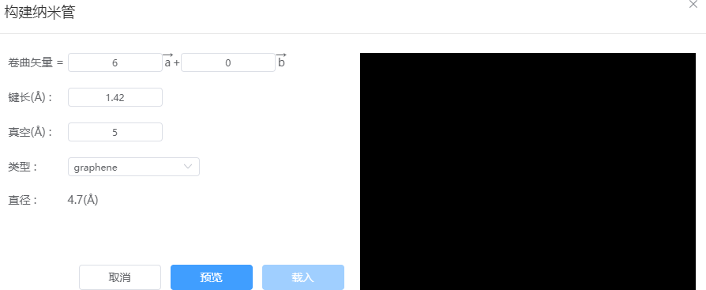

# 构建纳米管
支持通过指定卷曲矢量(N,M)、键长和真空层厚度来创建石墨烯或氮化硼纳米管，并自动计算显示纳米管直径

- 卷曲矢量：定义卷曲矢量OA=*N·a + M·b*，确定矩形区域OAO'B，将其沿OA方向卷曲形成在OB方向具有周期性的纳米管结构。

- 键长：原胞结构中，相邻两原子间的键长
- 真空：垂直纳米管的方向的真空层厚度
- 类型：可以为graphene或boron nitride
- 直径：根据卷曲矢量和键长，计算展示出纳米管的直径，单位为埃。