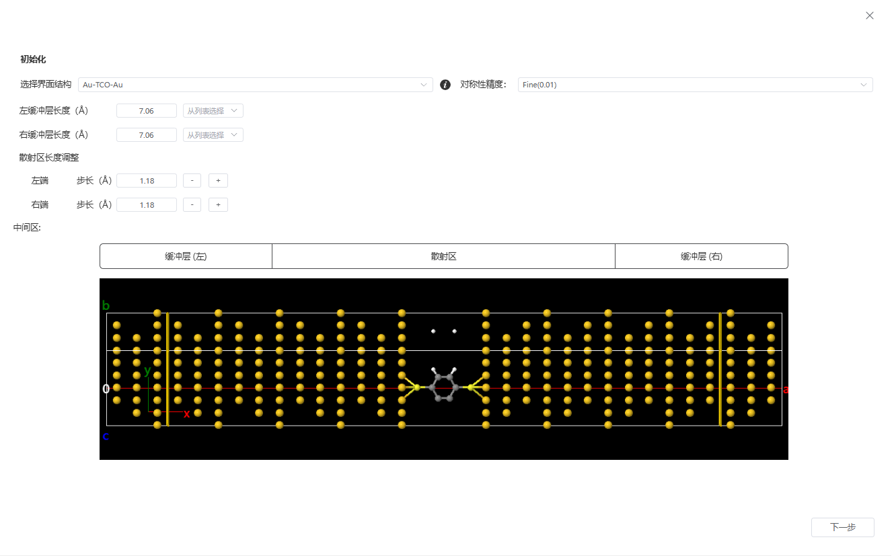
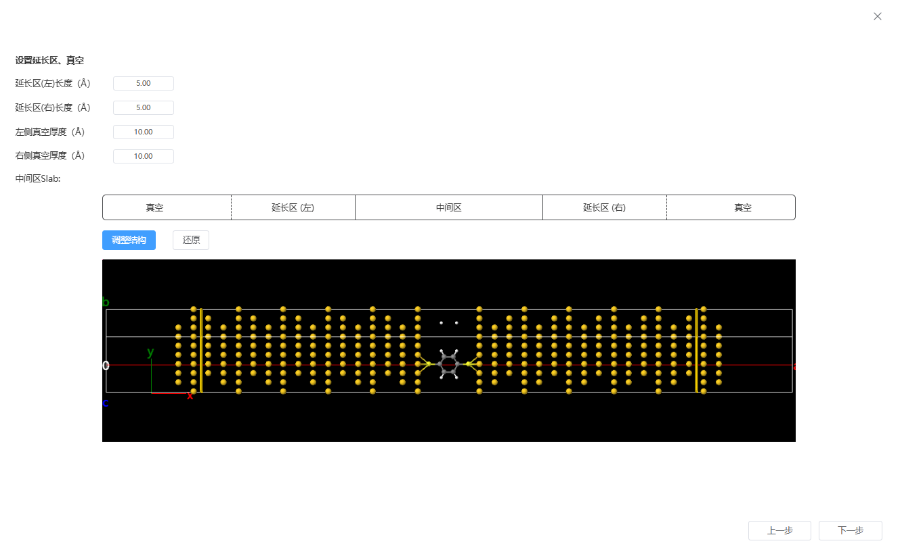
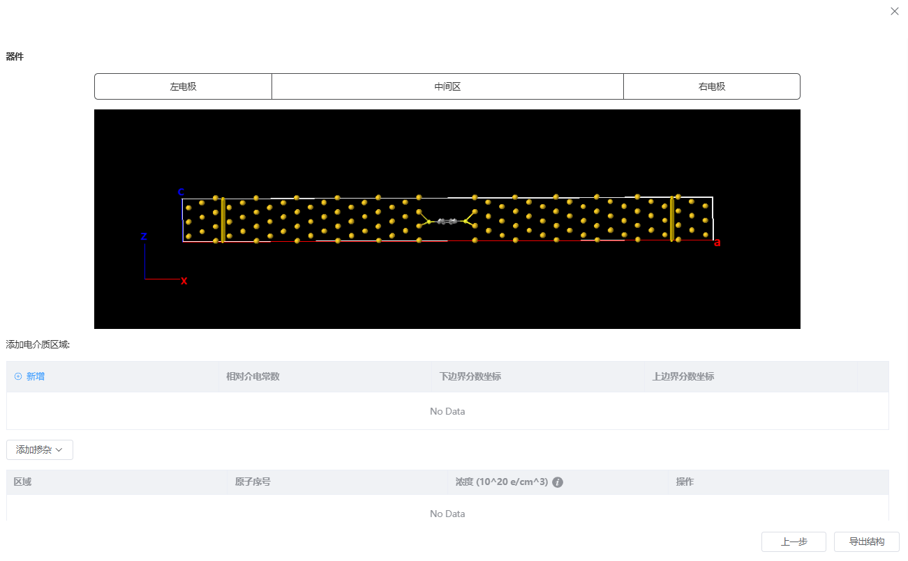

# NEGF方法（输运器件建模）

## 初始化



- 选择界面结构：需为有晶格的界面结构，通过对称性判断电极结构
  ```
  注意：电流方向为沿晶格a矢量方向。β、γ需等于90°
  ```
- 对称性精度：判断结构的对称性时的精度
- 左缓冲层长度，右缓冲层长度：上传结构后，依据所设置对称性精度判断结构的对称性，并生成初始电极列表。列表中提供了每个电极的长度和得分。若列表为空，需要用户手动设置缓冲层长度
- 散射区长度调整：通过`+`，`-`按钮从散射区的左端或右端增加、减少原子层。每次增加、减少的厚度会综合考虑所设置的步长和结构中原子层的厚度。

## 设置延长区、真空（中间区Slab模型）



- 延长区长度：调整中间区Slab模型的左右两端的延长区长度
- 真空厚度：调整中间区Slab模型的左右两端的真空厚度
- 调整结构：点击后，将中间区Slab模型加载到Q-Studio进行更细致的结构调整，如表面加氢钝化等操作。完成后，可点击右上角`返回NEGF编辑`
- 还原：重置中间区Slab模型

## 器件



- 添加电介质区域：在器件中间区定义电介质区域，包括上下边界的坐标和相对介电常数
- 添加掺杂：在左电极、右电极、中间区Slab中添加掺杂。
