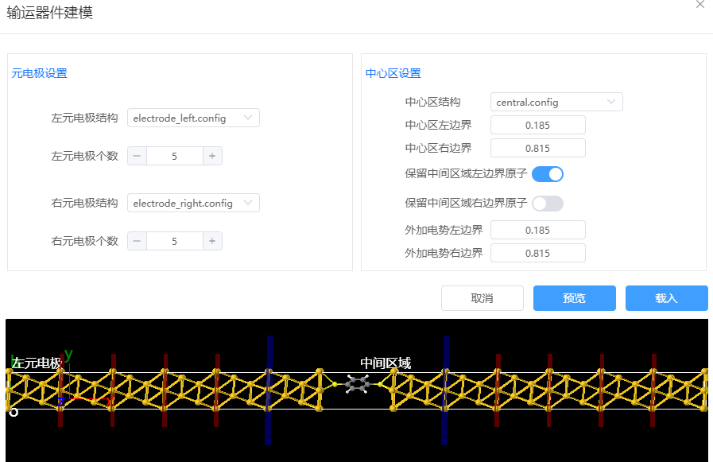
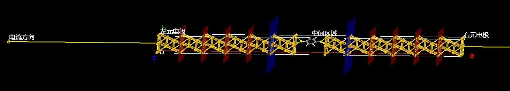
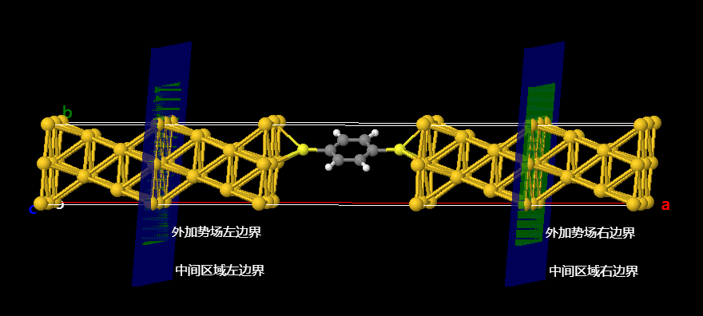

# 量子输运器件建模

以对苯二硫酚（DTB）与两个金电极表面构成的器件为例：

1. 分别构建左右元电极和中心区结构，并将其命名为electrode_left.config, electrode_right.config, central.config。中间区域结构的构建可参考分子建模和异质结构建模示例。
<table><tr>
    <td> 
        

            
        

    </td>
        <td> 
        

            
        

    </td>
        <td> 
        

            
        

    </td>
</tr></table>

2. 在菜单栏中依次点击`构建`→`输运器件建模`，打开输运器件建模窗口。分别选中左右元电极结构、中心区结构。器件的构建方向为x方向，电流的传输方向为从右至左。点击预览按钮可以预先查看拼接后的器件结构，确认无误后点击载入按钮将器件模型载入到Q-Studio界面中。

3. 中心区在后续计算中用于生成器件中间区域的势能函数，边界是截断势能函数的位置。外加电势的边界不能越过中心区边界。

4. 载入后，默认会显示器件的整体结构。在主界面点击工具后，可以切换到中间区结构。
   

5. 导出器件为PWmat格式到Q-Flow结构库中，可以进行后续的输运器件计算。