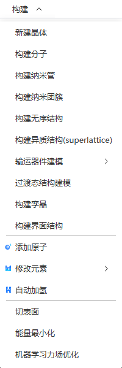

# 构建菜单

<!--  -->

- [新建晶体](../%E5%B7%A5%E5%85%B7/qstudio_manual_build_crystal.md)
- [构建分子](../%E5%B7%A5%E5%85%B7/qstudio_manual_build_molecule.md)
- [构建纳米管](../%E5%B7%A5%E5%85%B7/qstudio_manual_build_nanotube.md)
- [构建纳米团簇](../%E5%B7%A5%E5%85%B7/qstudio_manual_build_nanocluster.md)
- [构建无序结构(superlattice)](../%E5%B7%A5%E5%85%B7/qstudio_manual_build_packmol.md)
- [构建异质结构](../%E5%B7%A5%E5%85%B7/qstudio_manual_build_hetero.md)
- 输运器件建模：
  - [散射态方法](../%E5%B7%A5%E5%85%B7/qstudio_manual_build_transport_scattering.md)
  - [NEGF方法](../%E5%B7%A5%E5%85%B7/qstudio_manual_build_transport_negf.md)
- [过渡态结构建模](../%E5%B7%A5%E5%85%B7/qstudio_manual_build_neb.md)
- [构建孪晶](../%E5%B7%A5%E5%85%B7/qstudio_manual_build_twin.md)
- [构建界面结构](../%E5%B7%A5%E5%85%B7/qstudio_manual_build_boundary.md)

---

- [添加原子](../%E5%B7%A5%E5%85%B7/qstudio_manual_build_addatom.md)
- 修改元素：修改已选中原子的元素，点击元素周期表可打开[修改元素](../%E5%B7%A5%E5%85%B7/qstudio_modify_element.md)工具
- 自动加氢：根据元素和几何位置信息，自动添加氢原子。

---

- [切表面](../%E5%B7%A5%E5%85%B7/qstudio_manual_build_cleavesurface.md)
- [能量最小化](../%E5%B7%A5%E5%85%B7/qstudio_energy_minimization.md)
- [机器学习力场优化](../%E5%B7%A5%E5%85%B7/qstudio_mlff_relax.md)

